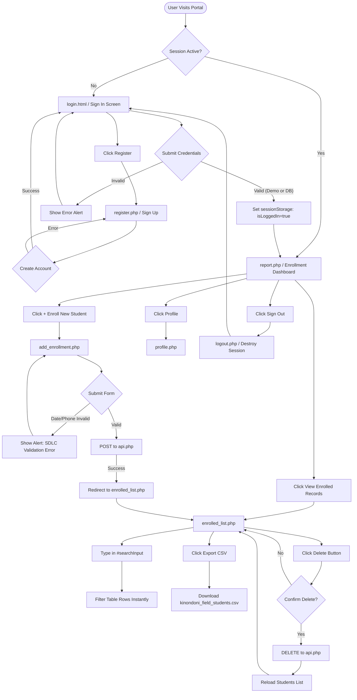

# App Flow & User Journey Document

## Project Title: Field Student Enrollment System
**Organization:** Kinondoni Municipal Council HQ  

---

## 1. High-Level System Workflow Diagram



---

## 2. Screen-by-Screen Detailed User Journeys

### Screen 1: Login Interface (`login.html`)
1. **User Landing:** User opens the application URL. If `sessionStorage.getItem('isLoggedIn') === 'true'`, system automatically redirects to `report.php`.
2. **Form Interaction:** User inputs Username/Email and Password into `#username` and `#password`.
3. **Demo Credential Match:** Entering `admin` / `admin123` instantly logs user in as `Training Officer (Admin)` without requiring a database connection.
4. **Database Credential Match:** If credentials differ from demo admin, `login.js` sends an HTTP POST request to `api.php?action=login`.
5. **Redirection:** On success, `sessionStorage` stores auth flags, and browser redirects to `report.php`.
6. **Registration Option:** Clicking "Register / Sign Up" navigates user to `register.php`.

### Screen 2: Dashboard Overview (`report.php`)
1. **Welcome Banner:** Displays custom greeting and quick action buttons (`+ Enroll New Student`, `📋 View Enrolled Records`).
2. **Metrics Grid:** Computes aggregate stats:
   - **Total Enrolled Students**
   - **Active Placements** (where `end_date >= current_date`)
   - **Completed Placements** (where `end_date < current_date`)
   - **Institutions Represented**
3. **Visual Charts Panel:**
   - **Enrollments Over Time:** Interactive line chart showing monthly practical training start trends.
   - **By Education Level:** Bar chart categorizing students by Certificate, Diploma, Degree.
   - **By Year of Study:** Bar chart categorizing students by Year 1 through Year 4.
   - **Top Institutions:** Doughnut chart breaking down placements by top universities/colleges.

### Screen 3: Enroll New Student (`add_enrollment.php`)
1. **Form Layout:** Presents clean `#enrollmentForm` with structured fields.
2. **Client Validation Check:**
   - **Date Chronology:** Ensures `endDate > startDate`. If `endDate <= startDate`, submission halts with alert: `"SDLC Validation Error: Ending day must be chronological after the Starting day."`
   - **Phone Regex:** Sanitizes input and tests `/^[0-9]{10}$/`.
3. **API Submission:** Sends JSON payload to `api.php`.
4. **Post-Submission Action:** Upon receiving `status: success`, displays success alert, clears form fields, and redirects to `enrolled_list.php`.

### Screen 4: Enrolled Records List (`enrolled_list.php`)
1. **Data Load:** Executes `loadStudents()` fetching `/api.php?action=students` on page mount.
2. **Status Badge Display:** Automatically evaluates `today <= endDate` for each student record:
   - If `true`: Renders green `.badge-active` badge (`Active`).
   - If `false`: Renders slate `.badge-completed` badge (`Completed`).
3. **Live Search Filtering:** Typing into `#searchInput` triggers `filterTable()`, filtering table rows instantaneously across name, institution, level, year, and phone.
4. **CSV Export:** Clicking "📥 Export CSV" executes `exportCSV()`, compiling student data into a downloadable CSV file named `kinondoni_field_students.csv`.
5. **Record Deletion:** Clicking "Delete" prompts user confirmation. Upon confirmation, sends HTTP `DELETE` to `api.php?id=X` and refreshes table.

### Screen 5: Officer Profile (`profile.php`)
1. **Profile View:** Displays officer details (Name, Role, Department, Email, Phone, Bio).
2. **Editable Form:** Clicking "Edit Profile" expands editable form fields.
3. **Local Persistence:** Saving profile updates local state and saves object to `localStorage.getItem('profile_training_officer')`.

### Screen 6: Sign Out (`logout.php`)
1. **Trigger:** User clicks "🚪 Sign Out" from sidebar menu.
2. **Cleanup:** `logout()` removes `sessionStorage` flags (`isLoggedIn`, `loggedInUser`), destroys server session in `logout.php`, and redirects user back to `login.html`.

---

## 3. Sidebar Collapse & Responsive Layout Flow

```
[Normal Screen (> 768px)]
  +------------------+--------------------------------------------------+
  | Sidebar (260px)  | Header Navbar (Fixed, Left: 260px)               |
  | - Logo           +--------------------------------------------------+
  | - Dashboard      | Main Content Container                           |
  | - Enrolled List  |                                                  |
  | - Enroll Form    |                                                  |
  | - Profile        |                                                  |
  | - Sign Out       |                                                  |
  +------------------+--------------------------------------------------+

[Collapsed Sidebar State (.sidebar-closed)]
  +------------------+--------------------------------------------------+
  | (Width: 0px)     | Header Navbar (Fixed, Left: 0px, Full Width)     |
  | (Hidden)         +--------------------------------------------------+
  |                  | Main Content Container (Full Width, Margin: 0px) |
  +------------------+--------------------------------------------------+
```
* **State Persistence:** Clicking `#sidebarToggle` toggles `.sidebar-closed` class on `.app-layout` and persists preference in `localStorage.setItem('sidebarClosed', 'true'|'false')`.
