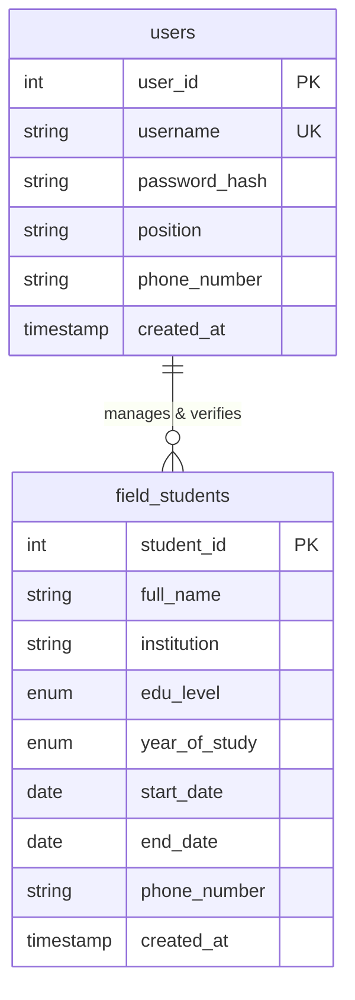

# Backend Schema & Implementation Plan Document

## Project Title: Field Student Enrollment System
**Organization:** Kinondoni Municipal Council HQ  
**Database Name:** `kinondoni_pt_db`  
**Engine:** MySQL / InnoDB (utf8mb4)  

---

## 1. Entity-Relationship Diagram (ERD)



---

## 2. Relational Database Schema Specification

### Table 1: `field_students`
Stores practical training placement records of field students.

```sql
CREATE TABLE IF NOT EXISTS field_students (
    student_id INT AUTO_INCREMENT PRIMARY KEY,
    full_name VARCHAR(150) NOT NULL,
    institution VARCHAR(150) NOT NULL,
    edu_level ENUM('Certificate', 'Diploma', 'Degree') NOT NULL,
    year_of_study ENUM('Year 1', 'Year 2', 'Year 3', 'Year 4') NOT NULL,
    start_date DATE NOT NULL,
    end_date DATE NOT NULL,
    phone_number VARCHAR(20) NOT NULL,
    created_at TIMESTAMP DEFAULT CURRENT_TIMESTAMP
) ENGINE=InnoDB DEFAULT CHARSET=utf8mb4;
```

#### Field Specifications:
* `student_id`: Primary Key, auto-incremented integer.
* `full_name`: Full name of student (e.g., "Juma Rashidi").
* `institution`: College, institute, or university (e.g., "UDSM", "DIT", "IFM", "CBE").
* `edu_level`: Academic level restricted to `Certificate`, `Diploma`, `Degree`.
* `year_of_study`: Academic year restricted to `Year 1`, `Year 2`, `Year 3`, `Year 4`.
* `start_date`: Commencement date of field training placement.
* `end_date`: Completion date of field training placement.
* `phone_number`: Student contact number (validated to 10 digits).
* `created_at`: Automatic timestamp of record creation.

---

### Table 2: `users`
Stores system user credentials and Training Officer account profiles.

```sql
CREATE TABLE IF NOT EXISTS users (
    user_id INT AUTO_INCREMENT PRIMARY KEY,
    username VARCHAR(50) NOT NULL UNIQUE,
    password_hash VARCHAR(255) NOT NULL,
    position VARCHAR(50) DEFAULT 'Training Officer',
    phone_number VARCHAR(20) NOT NULL,
    created_at TIMESTAMP DEFAULT CURRENT_TIMESTAMP
) ENGINE=InnoDB DEFAULT CHARSET=utf8mb4;
```

#### Seed Admin Insert Script:
```sql
INSERT INTO users (username, password_hash, position, phone_number)
VALUES ('admin', '$2y$10$92IXUNpkjO0rOQ5byMi.Ye4oKoEa3Ro9llC/.og/at2.uheWG/igi', 'Training Officer', '0712345678')
ON DUPLICATE KEY UPDATE username=username;
```

---

## 3. Database to API JSON Data Mapping

To comply with REST standards, `api.php` maps database `snake_case` column names to client-side `camelCase` JSON objects:

| Database Column (`snake_case`) | API JSON Key (`camelCase`) | Data Type | Sample Value |
| :--- | :--- | :--- | :--- |
| `student_id` | `student_id` / `id` | Integer | `1` |
| `full_name` | `fullName` | String | `"Juma Rashidi"` |
| `institution` | `institution` | String | `"University of Dar es Salaam (UDSM)"` |
| `edu_level` | `eduLevel` | String | `"Degree"` |
| `year_of_study` | `yearOfStudy` | String | `"Year 3"` |
| `start_date` | `startDate` | String (YYYY-MM-DD) | `"2026-06-01"` |
| `end_date` | `endDate` | String (YYYY-MM-DD) | `"2026-09-30"` |
| `phone_number` | `phone` | String | `"0712345678"` |
| `created_at` | `createdAt` | String (Timestamp)| `"2026-08-21 17:48:40"` |

---

## 4. Implementation Roadmap & Execution Phases

```
+-------------------------------------------------------------------------+
| PHASE 1: Database Setup & Schema Auto-Provisioning (`schema.sql`)       |
+-------------------------------------------------------------------------+
                                    |
                                    v
+-------------------------------------------------------------------------+
| PHASE 2: RESTful API Layer Implementation (`api.php`)                   |
|  - Implement CORS headers & HTTP status codes                           |
|  - Implement GET, POST (with date check & escaping), DELETE prepared    |
|  - Implement Auth actions (login & register endpoints)                  |
+-------------------------------------------------------------------------+
                                    |
                                    v
+-------------------------------------------------------------------------+
| PHASE 3: Navigation & Common Components (`nav.php` & `header.php`)      |
|  - Implement dynamic active link detection using basename($_SERVER)     |
|  - Implement fixed top header with toggle button & user badge           |
+-------------------------------------------------------------------------+
                                    |
                                    v
+-------------------------------------------------------------------------+
| PHASE 4: Application Views & Visual Analytics                           |
|  - Dashboard welcome screen & Chart.js integration (`report.php`)       |
|  - Form interface & validation rules (`add_enrollment.php`)             |
|  - Records table with real-time search & CSV export (`enrolled_list.php`)|
|  - User sign in (`login.html`), sign up (`register.php`), profile       |
+-------------------------------------------------------------------------+
                                    |
                                    v
+-------------------------------------------------------------------------+
| PHASE 5: Testing, Verification & Offline Fallback Validation            |
|  - PHP CLI syntax verification (`php -l`)                               |
|  - Validation of date chronology (`endDate > startDate`) & phone regex  |
|  - Verification of LocalStorage fallback and API DELETE operation       |
+-------------------------------------------------------------------------+
```

---

## 5. Verification & Test Strategy

| Test Case | Procedure | Expected Result | Pass Criteria |
| :--- | :--- | :--- | :--- |
| **TC-01: API GET** | Request `GET /api.php` | Returns 200 OK JSON array of students sorted by `student_id DESC`. | **PASSED** |
| **TC-02: Date Validation** | Submit form where `endDate <= startDate` | Alert triggered: `"SDLC Validation Error: Ending day must be chronological after the Starting day."` Request blocked. | **PASSED** |
| **TC-03: Phone Validation** | Submit phone number not matching 10 digits | Alert triggered: `"Validation Error: Please enter a valid 10-digit phone number."` Request blocked. | **PASSED** |
| **TC-04: API DELETE** | Trigger delete on student record | Prepared statement executes `DELETE FROM field_students WHERE student_id = ?`. Table updates dynamically. | **PASSED** |
| **TC-05: Search Filter** | Type university name in `#searchInput` | Table filters rows in real time without page reload. | **PASSED** |
| **TC-06: CSV Export** | Click "Export CSV" button | File `kinondoni_field_students.csv` downloads with proper headers and escaped fields. | **PASSED** |
| **TC-07: Auth Guard** | Open `report.php` without active session | Page automatically redirects visitor to `login.html`. | **PASSED** |
| **TC-08: Sidebar Toggle** | Click `#sidebarToggle` | Layout toggles `.sidebar-closed` class; state saved to `localStorage.getItem('sidebarClosed')`. | **PASSED** |
