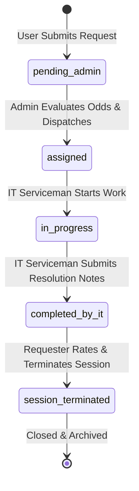
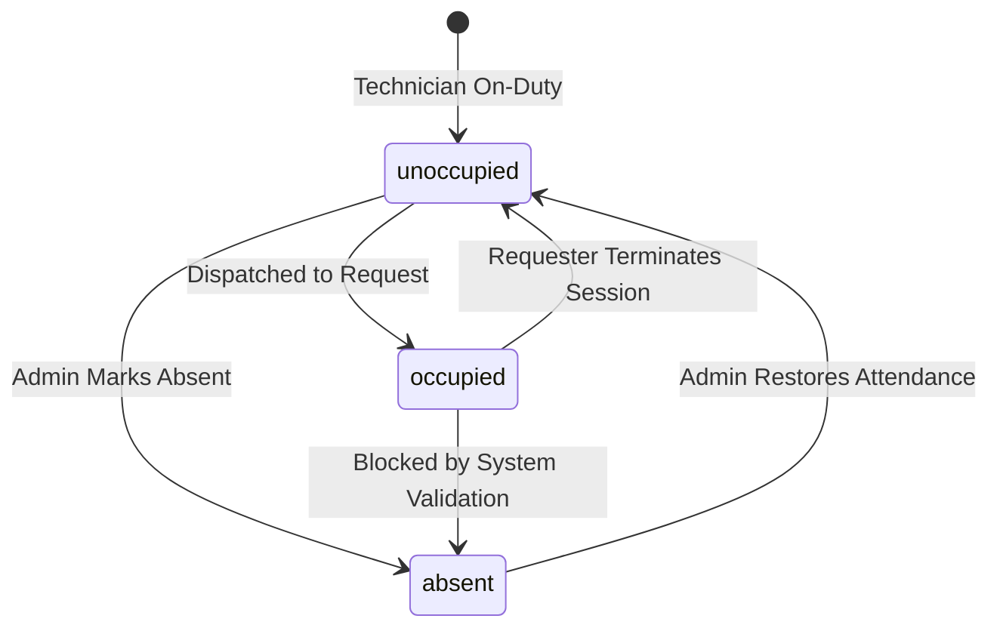
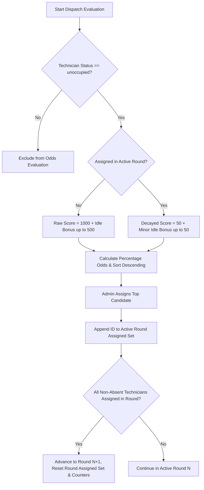
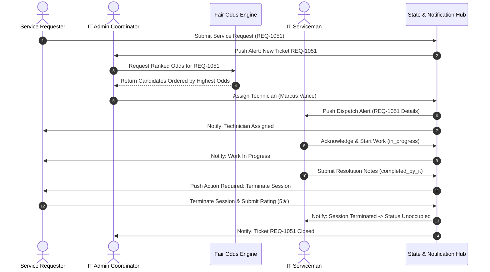

# IT SERVICE DISPATCH & FAIR ODDS MANAGEMENT SYSTEM
## APPLICATION FLOW & INTERACTION ARCHITECTURE DOCUMENTATION
**System Version:** 2.0.0 Enterprise Edition  
**Document Code:** AFD-2026-V2  
**Classification:** Technical & Operational Specification  
**Target Stakeholders:** Software Engineers, System Architects, IT Operations Leads, QA Specialists  
**Last Updated:** September 2026  

---

## 1. Executive Summary & Architectural Overview

The **IT Service Dispatch & Fair Odds Management System** is a mission-critical enterprise platform designed to solve dispatch favoritism, technician burnout, unbalanced workload distribution, and untracked service resolution loops.

Unlike naive first-in-first-out (FIFO) or manual ticketing queues, this platform introduces:
1. **Dynamic Fair Round-Robin Odds Allocation:** Calculates selection probabilities for unoccupied technicians using decay metrics and cohort exhaustion cycles.
2. **Tri-Role Modality:** Strict role separation across **Service Requester (User)**, **IT Operations Coordinator (Admin)**, and **Field IT Serviceman (Technician)**.
3. **Enforced Session Termination Lifecycle:** Guarantees that a technician remains locked in an occupied state until the end-user inspects the repair, submits a 1-5 star rating, and executes formal session termination.
4. **Admin-Exclusive Attendance Lockout:** Ensures only administrators have the authority to mark technicians absent or reactivate them back into the active dispatch queue.
5. **Multi-Actor Split Simulator:** Facilitates real-time verification of multi-role state propagation side-by-side.

---

## 2. Core System Actors & Stakeholder Personas

```
+----------------------------------------------------------------------------------------------------+
|                                    ACTOR TAXONOMY & CAPABILITIES                                   |
+-----------------------------------+--------------------------------+-------------------------------+
| 1. SERVICE REQUESTER (`user`)     | 2. IT ADMIN (`admin`)          | 3. IT SERVICEMAN (`it_guy`)   |
+-----------------------------------+--------------------------------+-------------------------------+
| * Identity: Employee needing help | * Identity: Dispatch Leader    | * Identity: Support Engineer  |
| * Intake: Custom / Presets        | * Triage: Queue Oversight      | * Alerts: Real-time Dispatch  |
| * Details: Building, Floor, Room  | * Engine: Odds Evaluation      | * Service: Start / In-Progress|
| * Status: Real-time Tracking      | * Personnel: Attendance Lock   | * Notes: Diagnostic & Repair  |
| * Authority: Session Termination  | * Governance: Audit Trail      | * Holding: Awaiting Release   |
+-----------------------------------+--------------------------------+-------------------------------+
```

### 2.1 Service Requester (End-User)
* **Identifier:** `user`
* **Core Permissions:** Create service requests, monitor live lifecycle status, review technician repair notes, rate service (1-5 stars), provide qualitative feedback, and terminate service sessions.
* **Key Constraints:** Cannot assign technicians directly; cannot modify technician attendance.

### 2.2 IT Operations Administrator (Coordinator / Supervisor)
* **Identifier:** `admin`
* **Core Permissions:** View organization-wide pending queues, trigger fair odds calculations, assign unoccupied technicians, toggle technician attendance (`absent` vs `unoccupied`), inspect active jobs, and review system audit trails.
* **Key Constraints:** Cannot terminate sessions on behalf of users (unless supervisory emergency override); cannot mark currently occupied technicians absent.

### 2.3 Field IT Serviceman (Technician)
* **Identifier:** `it_guy`
* **Core Permissions:** Receive real-time dispatch alerts, acknowledge and start jobs (`in_progress`), submit technical resolution notes, mark jobs completed (`completed_by_it`), and view personal rating metrics.
* **Key Constraints:** Cannot self-dispatch; cannot force status back to `unoccupied` without user session termination.

### 2.4 Multi-Actor Split Simulator
* **Identifier:** `split`
* **Purpose:** Renders all three roles simultaneously in a synchronized tripartite viewport, allowing developers and QA engineers to observe real-time state synchronization.

---

## 3. System State Machine & Lifecycle Transitions

### 3.1 Service Request Lifecycle Flow



#### Detailed State Transition Matrix:

| Initial State | Event / Trigger | Actor | Target State | System Side Effects & Invariants |
| :--- | :--- | :--- | :--- | :--- |
| `[None]` | User Submits Form | Requester | `pending_admin` | Generates `ticketNumber` (e.g. `REQ-1051`), triggers Admin alert notification, plays Alert tone, logs audit event `CREATED_REQUEST`. |
| `pending_admin` | Admin Dispatches | Admin | `assigned` | Sets `assignedITGuyId`, changes technician to `occupied`, increments round assignments, notifies technician and requester, plays Dispatch chime. |
| `assigned` | Start Service Clicked | Technician | `in_progress` | Sets `startedAt` timestamp, notifies requester that technician is on-site, logs audit event `STARTED_SERVICE`. |
| `in_progress` | Resolution Submitted | Technician | `completed_by_it` | Sets `completedAt`, records `resolutionNotes`, displays prominent Golden Termination Prompt on Requester screen. Technician remains `occupied`. |
| `completed_by_it` | Terminate Session | Requester | `session_terminated` | Sets `terminatedAt`, records `userRating` and `userFeedback`, resets technician status to `unoccupied`, updates technician lifetime rating, triggers confetti celebration and success chime. |

---

### 3.2 IT Serviceman Status Transitions



| Technician Status | Eligible for Dispatch Evaluation? | How Entered | How Exited |
| :--- | :---: | :--- | :--- |
| `unoccupied` | **YES** | Shift start, admin restoration, or session termination. | Dispatched to a request (`occupied`) or marked absent by admin (`absent`). |
| `occupied` | **NO** | Admin dispatches technician to an active ticket. | Requester formally terminates session and submits review. |
| `absent` | **NO** | Admin marks technician absent in Attendance Hub. | Admin marks technician back to unoccupied upon return to duty. |

---

### 3.3 Dispatch Iteration Round & Cohort Exhaustion Logic



---

## 4. Comprehensive User Journey Flows

### Flow 1: Service Requester Ticket Creation
```
+---------------------------------------------------------------------------------------------------+
| USER PORTAL: TICKET INTAKE FLOW                                                                   |
+---------------------------------------------------------------------------------------------------+
| [1. Open User Portal]                                                                             |
|       |                                                                                           |
|       v                                                                                           |
| [2. Select Input Mode] -----> Option A: One-Click Issue Template (e.g. 'Monitor Flickering')       |
|       |                 -----> Option B: Custom Title & Detailed Symptoms Description             |
|       v                                                                                           |
| [3. Select Classification] --> Category: Hardware / Software / Network / Printer / Access / AV   |
|       |                    --> Urgency: Low / Medium / High / Critical                            |
|       v                                                                                           |
| [4. Confirm Exact Location] -> Building: [Building 2] | Floor: [Floor 3] | Room: [Room 304]        |
|       |                                                                                           |
|       v                                                                                           |
| [5. Click 'Submit Service Request']                                                               |
|       |                                                                                           |
|       +--> Ticket Created: REQ-1051 (Status: pending_admin)                                       |
|       +--> Push Notification Dispatched to Admin Command Center                                   |
|       +--> Web Audio Alert Tone Generated                                                         |
|       +--> System Audit Log Entry Created                                                         |
+---------------------------------------------------------------------------------------------------+
```

### Flow 2: Admin Queue Evaluation & Odds-Based Dispatch
```
+---------------------------------------------------------------------------------------------------+
| ADMIN COMMAND CENTER: DISPATCH FLOW                                                               |
+---------------------------------------------------------------------------------------------------+
| [1. Receive Incoming Ticket Notification in Queue]                                                |
|       |                                                                                           |
|       v                                                                                           |
| [2. Click 'Evaluate & Dispatch IT Guy' on Ticket REQ-1051]                                        |
|       |                                                                                           |
|       v                                                                                           |
| [3. Odds Engine Calculates Rankings]:                                                             |
|       - Filters only 'unoccupied' technicians                                                     |
|       - Evaluates time since last assignment (idle bonus)                                         |
|       - Applies fresh turn bonus (1000) vs round decay (50)                                       |
|       - Normalizes scores into percentage odds (e.g., Marcus Vance: 72%)                          |
|       |                                                                                           |
|       v                                                                                           |
| [4. Dispatch Modal Opens]:                                                                        |
|       - Strictly ordered by Highest Odds                                                          |
|       - Shows Candidate 1: Marcus Vance (72% Odds, Top Recommendation)                             |
|       - Shows Candidate 2: Elena Rostova (22% Odds)                                               |
|       - Shows Candidate 3: Samira Khan (6% Odds, Already Assigned in Round 1)                     |
|       |                                                                                           |
|       v                                                                                           |
| [5. Admin Confirms Selection -> Clicks 'Push Notification & Assign']                              |
|       |                                                                                           |
|       +--> Ticket REQ-1051 Status -> 'assigned'                                                   |
|       +--> Marcus Vance Status -> 'occupied'                                                      |
|       +--> Instant Alert Pushed to Marcus Vance's Device                                          |
|       +--> Status Update Pushed to Requester                                                      |
|       +--> Dispatch Chime Sounded                                                                 |
+---------------------------------------------------------------------------------------------------+
```

### Flow 3: IT Serviceman On-Site Resolution Flow
```
+---------------------------------------------------------------------------------------------------+
| IT SERVICEMAN WORKSPACE: RESOLUTION FLOW                                                          |
+---------------------------------------------------------------------------------------------------+
| [1. Real-Time Alert Received: 'New Dispatch: REQ-1051']                                           |
|       |                                                                                           |
|       v                                                                                           |
| [2. Review Requester Location: Building 2, Floor 3, Room 304]                                     |
|       |                                                                                           |
|       v                                                                                           |
| [3. Arrive On-Site & Click 'Acknowledge & Start Service']                                         |
|       |                                                                                           |
|       +--> Ticket Status -> 'in_progress'                                                         |
|       +--> Requester Notified: 'Technician has arrived and started work'                          |
|       |                                                                                           |
|       v                                                                                           |
| [4. Perform Technical Diagnostics, Cable Replacement & Verification]                              |
|       |                                                                                           |
|       v                                                                                           |
| [5. Click 'Mark Service as Completed']                                                            |
|       |                                                                                           |
|       v                                                                                           |
| [6. Enter Resolution Notes: 'Replaced faulty Thunderbolt cable. Verified stable 4K output.']      |
|       |                                                                                           |
|       v                                                                                           |
| [7. Submit Resolution]                                                                            |
|       |                                                                                           |
|       +--> Ticket Status -> 'completed_by_it'                                                     |
|       +--> Requester Receives Urgent Action Banner                                                |
|       +--> Technician Remains 'occupied' in Holding State Awaiting User Termination               |
+---------------------------------------------------------------------------------------------------+
```

### Flow 4: Requester Verification & Session Termination
```
+---------------------------------------------------------------------------------------------------+
| USER PORTAL: SESSION TERMINATION FLOW                                                             |
+---------------------------------------------------------------------------------------------------+
| [1. Golden Alert Banner Appears: 'Action Required: Work Finished by IT Serviceman']              |
|       |                                                                                           |
|       v                                                                                           |
| [2. Requester Reviews Logged Notes & Inspects Physical Hardware]                                  |
|       |                                                                                           |
|       v                                                                                           |
| [3. Click 'Terminate Session & Rate']                                                             |
|       |                                                                                           |
|       v                                                                                           |
| [4. Modal Opens: Select 5 Stars & Input Feedback: 'Super fast and helpful resolution!']          |
|       |                                                                                           |
|       v                                                                                           |
| [5. Click 'Confirm & Free Technician']                                                            |
|       |                                                                                           |
|       +--> Ticket Status -> 'session_terminated' (Closed)                                         |
|       +--> Technician Marcus Vance Status -> 'unoccupied' (Available for Next Dispatch)           |
|       +--> Technician Lifetime Metrics: Completed +1, Rating Recomputed                           |
|       +--> Confetti Particle Explosion Displayed                                                  |
|       +--> Success Audio Chime Triggered                                                          |
|       +--> Notification Dispatched to Admin & Technician                                          |
+---------------------------------------------------------------------------------------------------+
```

### Flow 5: Admin Attendance Management Flow
```
+---------------------------------------------------------------------------------------------------+
| ADMIN ATTENDANCE & ROSTER OVERRIDE FLOW                                                           |
+---------------------------------------------------------------------------------------------------+
| [1. Admin Navigates to 'IT Servicemen Roster & Attendance' Tab]                                   |
|       |                                                                                           |
|       v                                                                                           |
| [2. Inspect Attendance States]:                                                                   |
|       - Marcus Vance: UNOCCUPIED                                                                  |
|       - Tariq Al-Mansoor: OCCUPIED (Attending REQ-1049)                                           |
|       - Chloe Bennett: ABSENT (Marked by Admin)                                                   |
|       |                                                                                           |
|       v                                                                                           |
| [3. Action Scenario A: Technician Leaves Duty / Sick]                                             |
|       - Admin clicks 'Mark Absent' on Unoccupied technician                                       |
|       - Status -> 'absent'                                                                        |
|       - Technician automatically excluded from odds evaluations                                   |
|       |                                                                                           |
|       v                                                                                           |
| [4. Action Scenario B: Technician Returns to Duty]                                                |
|       - Admin clicks 'Mark Back to Work (Unoccupied)'                                             |
|       - Status -> 'unoccupied'                                                                    |
|       - Technician re-enters odds pool immediately                                                |
+---------------------------------------------------------------------------------------------------+
```

---

## 5. Event Trigger & Notification Propagation Matrix

| Event Name | Source Actor | Target Audience | Notification Payload / Message | Notification Type | Audio Asset |
| :--- | :--- | :--- | :--- | :--- | :--- |
| `TICKET_CREATED` | Requester | Admin | 📥 New Request: REQ-XXXX submitted by [Name] ([Dept]) | `alert` | Alert Tone |
| `DISPATCH_ASSIGNED` | Admin | Technician | ⚡ New Dispatch: REQ-XXXX. Proceed to [Room] ([Building]) | `dispatch` | Dispatch Chime |
| `DISPATCH_ASSIGNED` | Admin | Requester | 👨‍🔧 Technician Assigned: [Name] is on the way | `status_update` | Subtle Ping |
| `SERVICE_STARTED` | Technician | Requester | 🔧 Service in Progress: Technician has arrived on-site | `status_update` | None |
| `SERVICE_COMPLETED` | Technician | Requester | 🎉 Service Finished: Action Required on REQ-XXXX | `completion` | Alert Tone |
| `SESSION_TERMINATED` | Requester | Technician | ✅ Session Terminated: REQ-XXXX ([Rating] Stars). Status UNOCCUPIED | `termination` | Success Chime |
| `SESSION_TERMINATED` | Requester | Admin | 🏁 Ticket Closed: REQ-XXXX terminated by [Name] | `status_update` | Success Chime |
| `ATTENDANCE_OVERRIDE`| Admin | Technician | 🌴 / ✅ Status Marked: [Absent / Unoccupied & Available] | `alert` | Subtle Ping |

---

## 6. Edge Cases, Race Conditions & Failure Recoveries

1. **Zero Unoccupied Technicians:**
   * *Behavior:* If all non-absent technicians are occupied or absent, the odds engine returns an empty ranking array. The Admin Dispatch modal displays a clear notification banner explaining that all technicians are occupied on active requests.
2. **Technician Marked Absent During Active Round:**
   * *Behavior:* The cohort count recalculates. The round advances automatically once all remaining non-absent technicians have been assigned.
3. **Forgotten Session Termination by User:**
   * *Behavior:* The technician remains locked in holding (`occupied`) to prevent queue starvation. Admin portal displays a clear `Pending Termination` indicator, allowing admin supervisor follow-up.
4. **Simultaneous Multi-Ticket Dispatch:**
   * *Behavior:* Immediate local and backend state mutation ensures that as soon as a technician is assigned to Ticket A, their status becomes `occupied`, preventing them from appearing as available for Ticket B.

---

## 7. System Interaction Sequence Diagram



---
*End of App Flow Documentation.*
