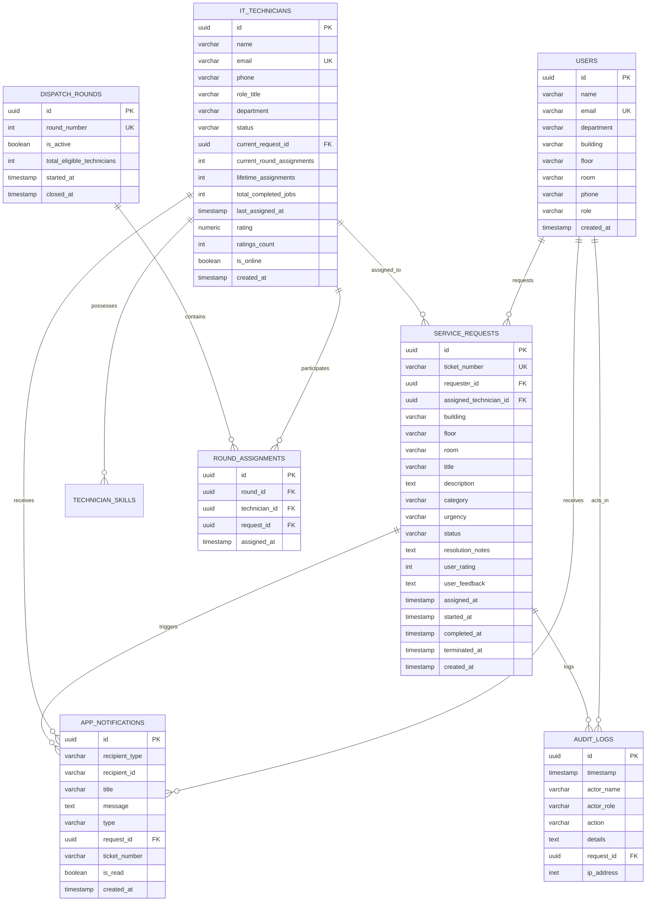
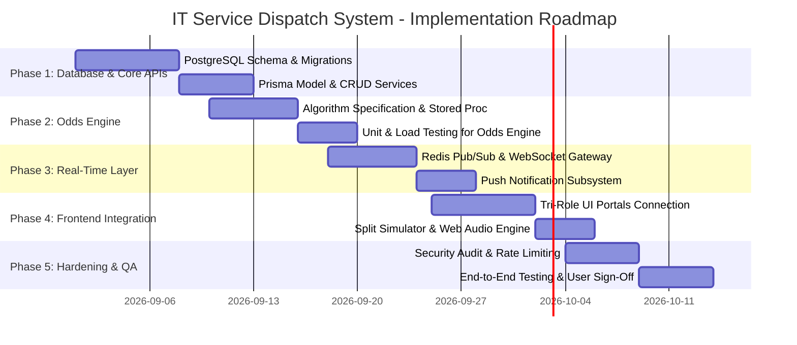

# IT SERVICE DISPATCH & FAIR ODDS MANAGEMENT SYSTEM
## BACKEND SCHEMA & SYSTEM IMPLEMENTATION PLAN
**System Version:** 2.0.0 Enterprise Edition  
**Document Code:** BSD-2026-V2  
**Classification:** Backend Engineering & Infrastructure Specification  
**Target Stakeholders:** Backend Engineers, Database Administrators, DevOps/SRE, Cloud Architects  
**Last Updated:** September 2026  

---

## 1. System Architecture & Tech Stack Strategy

The production backend architecture for the **IT Service Dispatch System** is designed for high availability, sub-50ms dispatch latency, strict ACID guarantees on ticket state transitions, and real-time push synchronization across distributed clients.

```
+----------------------------------------------------------------------------------------------------+
|                                PRODUCTION BACKEND ARCHITECTURE                                     |
+----------------------------------------------------------------------------------------------------+
|                                                                                                    |
|    [ React 19 Client Tier ] <====== HTTPS / WSS ======> [ Cloudflare Edge / SSL / CDN ]            |
|                                                                     |                              |
|                                                                     v                              |
|                                                     [ NGINX API Gateway & Rate Limiter ]           |
|                                                                     |                              |
|                                      +------------------------------+------------------------------+
|                                      |                                                             |
|                                      v                                                             v
|                         [ RESTful API Services ]                                     [ WebSocket Engine ]  
|                         (Node.js / Express / TS)                                     (Socket.io / Redis)   
|                                      |                                                             |
|                   +------------------+------------------+                                          |
|                   |                                     |                                          |
|                   v                                     v                                          |
|         [ Odds Calculation Engine ]          [ Attendance & State Machine ]                        |
|                   |                                     |                                          |
|                   +------------------+------------------+                                          |
|                                      |                                                             |
|                                      v                                                             |
|                        [ Prisma ORM / Query Builder ]                                              |
|                                      |                                                             |
|                   +------------------+------------------+                                          |
|                   |                                     |                                          |
|                   v                                     v                                          |
|         [ PostgreSQL 16 Primary ]            [ Redis 7 Cluster ]                                   |
|         - ACID State Transitions             - Real-time Pub/Sub Messaging                         |
|         - Foreign Keys & Indexes             - Ephemeral Cache & Locks                             |
|         - PgBouncer Pooling                  - Session Store                                       |
|                                                                                                    |
+----------------------------------------------------------------------------------------------------+
```

### Production Stack Components:
1. **Core Runtime:** Node.js v24 LTS with TypeScript 5.8 (Strict Mode).
2. **Web Framework:** Express 4.21 / Fastify for REST endpoints.
3. **Database:** PostgreSQL 16 with connection pooling via **PgBouncer**.
4. **ORM & Schema Migration:** Prisma ORM / Kysely for type-safe database access.
5. **In-Memory Cache & Broker:** Redis 7 (Streams & Pub/Sub for WebSockets).
6. **Real-Time Communication:** WebSockets (`ws` / Socket.io) + Server-Sent Events (SSE).
7. **Security & Validation:** JWT (RS256), Zod schema validation, Helmet, CORS, Argon2id.

---

## 2. PostgreSQL Relational Schema & DDL Specification



### Complete SQL DDL Script:

```sql
-- Enable UUID extension
CREATE EXTENSION IF NOT EXISTS "uuid-ossp";

-- 1. ENUM TYPES
CREATE TYPE user_role_enum AS ENUM ('user', 'admin', 'it_guy');
CREATE TYPE it_guy_status_enum AS ENUM ('unoccupied', 'occupied', 'absent');
CREATE TYPE request_status_enum AS ENUM ('pending_admin', 'assigned', 'in_progress', 'completed_by_it', 'session_terminated');
CREATE TYPE request_urgency_enum AS ENUM ('low', 'medium', 'high', 'critical');
CREATE TYPE request_category_enum AS ENUM ('Hardware', 'Software', 'Network & WiFi', 'Printer & Peripherals', 'Access & Security', 'Audio/Visual');
CREATE TYPE notification_type_enum AS ENUM ('dispatch', 'status_update', 'completion', 'termination', 'alert');

-- 2. USERS TABLE
CREATE TABLE users (
    id UUID PRIMARY KEY DEFAULT uuid_generate_v4(),
    name VARCHAR(100) NOT NULL,
    email VARCHAR(150) UNIQUE NOT NULL,
    avatar_url TEXT NOT NULL,
    department VARCHAR(100) NOT NULL,
    location_building VARCHAR(50) NOT NULL,
    location_floor VARCHAR(50) NOT NULL,
    location_room VARCHAR(50) NOT NULL,
    phone VARCHAR(50) NOT NULL,
    role user_role_enum NOT NULL DEFAULT 'user',
    created_at TIMESTAMP WITH TIME ZONE DEFAULT CURRENT_TIMESTAMP,
    updated_at TIMESTAMP WITH TIME ZONE DEFAULT CURRENT_TIMESTAMP
);

-- 3. IT TECHNICIANS TABLE
CREATE TABLE it_technicians (
    id UUID PRIMARY KEY DEFAULT uuid_generate_v4(),
    name VARCHAR(100) NOT NULL,
    email VARCHAR(150) UNIQUE NOT NULL,
    avatar_url TEXT NOT NULL,
    phone VARCHAR(50) NOT NULL,
    role_title VARCHAR(100) NOT NULL DEFAULT 'IT Support Engineer',
    department VARCHAR(100) NOT NULL DEFAULT 'IT End-User Services',
    status it_guy_status_enum NOT NULL DEFAULT 'unoccupied',
    current_request_id UUID NULL,
    current_round_assignments INT NOT NULL DEFAULT 0,
    lifetime_assignments INT NOT NULL DEFAULT 0,
    total_completed_jobs INT NOT NULL DEFAULT 0,
    last_assigned_at TIMESTAMP WITH TIME ZONE NULL,
    rating NUMERIC(3, 2) NOT NULL DEFAULT 5.00,
    ratings_count INT NOT NULL DEFAULT 0,
    is_online BOOLEAN NOT NULL DEFAULT TRUE,
    created_at TIMESTAMP WITH TIME ZONE DEFAULT CURRENT_TIMESTAMP,
    updated_at TIMESTAMP WITH TIME ZONE DEFAULT CURRENT_TIMESTAMP
);

-- 4. TECHNICIAN SKILLS TABLE
CREATE TABLE technician_skills (
    id UUID PRIMARY KEY DEFAULT uuid_generate_v4(),
    technician_id UUID NOT NULL REFERENCES it_technicians(id) ON DELETE CASCADE,
    skill_name VARCHAR(100) NOT NULL,
    created_at TIMESTAMP WITH TIME ZONE DEFAULT CURRENT_TIMESTAMP,
    UNIQUE(technician_id, skill_name)
);

-- 5. SERVICE REQUESTS TABLE
CREATE TABLE service_requests (
    id UUID PRIMARY KEY DEFAULT uuid_generate_v4(),
    ticket_number VARCHAR(30) UNIQUE NOT NULL,
    requester_id UUID NOT NULL REFERENCES users(id) ON DELETE RESTRICT,
    requester_name VARCHAR(100) NOT NULL,
    requester_email VARCHAR(150) NOT NULL,
    requester_dept VARCHAR(100) NOT NULL,
    requester_phone VARCHAR(50) NOT NULL,
    location_building VARCHAR(50) NOT NULL,
    location_floor VARCHAR(50) NOT NULL,
    location_room VARCHAR(50) NOT NULL,
    title VARCHAR(255) NOT NULL,
    description TEXT NOT NULL,
    category request_category_enum NOT NULL,
    urgency request_urgency_enum NOT NULL DEFAULT 'medium',
    status request_status_enum NOT NULL DEFAULT 'pending_admin',
    
    -- Assignment details
    assigned_technician_id UUID NULL REFERENCES it_technicians(id) ON DELETE SET NULL,
    assigned_technician_name VARCHAR(100) NULL,
    assigned_technician_avatar TEXT NULL,
    assigned_at TIMESTAMP WITH TIME ZONE NULL,
    started_at TIMESTAMP WITH TIME ZONE NULL,
    completed_at TIMESTAMP WITH TIME ZONE NULL,
    terminated_at TIMESTAMP WITH TIME ZONE NULL,
    
    -- Resolution details
    resolution_notes TEXT NULL,
    user_rating INT NULL CHECK (user_rating >= 1 AND user_rating <= 5),
    user_feedback TEXT NULL,
    
    created_at TIMESTAMP WITH TIME ZONE DEFAULT CURRENT_TIMESTAMP,
    updated_at TIMESTAMP WITH TIME ZONE DEFAULT CURRENT_TIMESTAMP
);

-- Foreign key link for current_request_id on technicians
ALTER TABLE it_technicians 
ADD CONSTRAINT fk_technician_current_request 
FOREIGN KEY (current_request_id) REFERENCES service_requests(id) ON DELETE SET NULL;

-- 6. DISPATCH ROUNDS TABLE
CREATE TABLE dispatch_rounds (
    id UUID PRIMARY KEY DEFAULT uuid_generate_v4(),
    round_number INT UNIQUE NOT NULL,
    is_active BOOLEAN NOT NULL DEFAULT TRUE,
    total_eligible_technicians INT NOT NULL DEFAULT 0,
    started_at TIMESTAMP WITH TIME ZONE DEFAULT CURRENT_TIMESTAMP,
    closed_at TIMESTAMP WITH TIME ZONE NULL
);

-- 7. ROUND ASSIGNMENTS TRACKING TABLE
CREATE TABLE round_assignments (
    id UUID PRIMARY KEY DEFAULT uuid_generate_v4(),
    round_id UUID NOT NULL REFERENCES dispatch_rounds(id) ON DELETE CASCADE,
    technician_id UUID NOT NULL REFERENCES it_technicians(id) ON DELETE CASCADE,
    request_id UUID NOT NULL REFERENCES service_requests(id) ON DELETE CASCADE,
    assigned_at TIMESTAMP WITH TIME ZONE DEFAULT CURRENT_TIMESTAMP,
    UNIQUE(round_id, technician_id)
);

-- 8. APP NOTIFICATIONS TABLE
CREATE TABLE app_notifications (
    id UUID PRIMARY KEY DEFAULT uuid_generate_v4(),
    recipient_type VARCHAR(20) NOT NULL, -- 'user', 'it_guy', 'admin', 'all'
    recipient_id VARCHAR(50) NOT NULL, -- UUID or 'admin'
    title VARCHAR(200) NOT NULL,
    message TEXT NOT NULL,
    type notification_type_enum NOT NULL DEFAULT 'alert',
    request_id UUID NULL REFERENCES service_requests(id) ON DELETE CASCADE,
    ticket_number VARCHAR(30) NULL,
    is_read BOOLEAN NOT NULL DEFAULT FALSE,
    created_at TIMESTAMP WITH TIME ZONE DEFAULT CURRENT_TIMESTAMP
);

-- 9. AUDIT LOGS TABLE
CREATE TABLE audit_logs (
    id UUID PRIMARY KEY DEFAULT uuid_generate_v4(),
    timestamp TIMESTAMP WITH TIME ZONE DEFAULT CURRENT_TIMESTAMP,
    actor_name VARCHAR(100) NOT NULL,
    actor_role user_role_enum NOT NULL,
    action VARCHAR(100) NOT NULL,
    details TEXT NOT NULL,
    request_id UUID NULL REFERENCES service_requests(id) ON DELETE SET NULL,
    ip_address INET NULL
);

-- 10. INDEXES FOR PERFORMANCE OPTIMIZATION
CREATE INDEX idx_requests_status ON service_requests(status);
CREATE INDEX idx_requests_requester ON service_requests(requester_id);
CREATE INDEX idx_requests_technician ON service_requests(assigned_technician_id);
CREATE INDEX idx_technicians_status ON it_technicians(status);
CREATE INDEX idx_notifications_recipient ON app_notifications(recipient_id, is_read);
CREATE INDEX idx_audit_timestamp ON audit_logs(timestamp DESC);
CREATE INDEX idx_round_active ON dispatch_rounds(is_active);
```

---

## 3. Odds Engine & Dispatch Mathematical Logic

### 3.1 Mathematical Formulation
Let $U = \{T_1, T_2, \dots, T_k\}$ be the set of all technicians where $	ext{status}(T_i) = 	ext{'unoccupied'}$.

For each technician $T_i \in U$:
1. Let $m_i$ be the idle duration in minutes since $T_i$'s `last_assigned_at` (if `last_assigned_at` is null, $m_i \leftarrow 9999$).
2. Let $a_i$ be a boolean indicating whether $T_i$ has already been assigned in the active round $R_n$.

The raw priority score $S(T_i)$ is computed as:
$$
S(T_i) = 
egin{cases} 
1000 + \min(m_i 	imes 2, 500), & 	ext{if } a_i = 	ext{false} 	ext{ (Fresh turn in Round } R_n	ext{)} \
50 + \min(m_i 	imes 0.2, 50), & 	ext{if } a_i = 	ext{true} 	ext{ (Already assigned in Round } R_n	ext{)}
\end{cases}
$$

The normalized selection odds percentage $P(T_i)$ is:
$$
P(T_i) = \left( rac{S(T_i)}{\sum_{j=1}^k S(T_j)} 
ight) 	imes 100\%
$$

### 3.2 Atomic Round Rollover Algorithm (PostgreSQL Stored Procedure)

```sql
CREATE OR REPLACE FUNCTION process_technician_dispatch(
    p_request_id UUID,
    p_technician_id UUID,
    p_admin_name VARCHAR(100)
) RETURNS JSONB AS $$
DECLARE
    v_round_id UUID;
    v_round_number INT;
    v_eligible_count INT;
    v_assigned_count INT;
    v_now TIMESTAMP WITH TIME ZONE := CURRENT_TIMESTAMP;
    v_ticket_num VARCHAR(30);
    v_requester_id UUID;
    v_requester_name VARCHAR(100);
    v_room VARCHAR(50);
    v_building VARCHAR(50);
BEGIN
    -- 1. Validate request state
    SELECT ticket_number, requester_id, requester_name, location_room, location_building
    INTO v_ticket_num, v_requester_id, v_requester_name, v_room, v_building
    FROM service_requests
    WHERE id = p_request_id AND status = 'pending_admin'
    FOR UPDATE;

    IF NOT FOUND THEN
        RAISE EXCEPTION 'Request % is not in pending_admin state or does not exist.', p_request_id;
    END IF;

    -- 2. Validate technician state
    PERFORM 1 FROM it_technicians 
    WHERE id = p_technician_id AND status = 'unoccupied'
    FOR UPDATE;

    IF NOT FOUND THEN
        RAISE EXCEPTION 'Technician % is not unoccupied or does not exist.', p_technician_id;
    END IF;

    -- 3. Update Request
    UPDATE service_requests
    SET status = 'assigned',
        assigned_technician_id = p_technician_id,
        assigned_at = v_now,
        updated_at = v_now
    WHERE id = p_request_id;

    -- 4. Update Technician
    UPDATE it_technicians
    SET status = 'occupied',
        current_request_id = p_request_id,
        current_round_assignments = current_round_assignments + 1,
        lifetime_assignments = lifetime_assignments + 1,
        last_assigned_at = v_now,
        updated_at = v_now
    WHERE id = p_technician_id;

    -- 5. Fetch Active Round
    SELECT id, round_number INTO v_round_id, v_round_number
    FROM dispatch_rounds
    WHERE is_active = TRUE
    FOR UPDATE;

    -- Record Round Assignment
    INSERT INTO round_assignments (round_id, technician_id, request_id, assigned_at)
    VALUES (v_round_id, p_technician_id, p_request_id, v_now)
    ON CONFLICT (round_id, technician_id) DO NOTHING;

    -- 6. Check for Cohort Exhaustion
    SELECT COUNT(*) INTO v_eligible_count FROM it_technicians WHERE status != 'absent';
    SELECT COUNT(DISTINCT technician_id) INTO v_assigned_count FROM round_assignments WHERE round_id = v_round_id;

    IF v_assigned_count >= v_eligible_count AND v_eligible_count > 0 THEN
        -- Close current round
        UPDATE dispatch_rounds SET is_active = FALSE, closed_at = v_now WHERE id = v_round_id;
        
        -- Start new round
        INSERT INTO dispatch_rounds (round_number, is_active, total_eligible_technicians, started_at)
        VALUES (v_round_number + 1, TRUE, v_eligible_count, v_now);

        -- Reset round assignment counters
        UPDATE it_technicians SET current_round_assignments = 0;
    END IF;

    -- 7. Insert Notifications
    INSERT INTO app_notifications (recipient_type, recipient_id, title, message, type, request_id, ticket_number)
    VALUES 
    ('it_guy', p_technician_id::text, '⚡ New Dispatch: ' || v_ticket_num, 
     'Assigned to assist ' || v_requester_name || ' at ' || v_room || ' (' || v_building || ')', 'dispatch', p_request_id, v_ticket_num),
    ('user', v_requester_id::text, '👨‍🔧 Technician Assigned', 
     'An IT technician is on the way to resolve your ticket.', 'status_update', p_request_id, v_ticket_num);

    -- 8. Record Audit Log
    INSERT INTO audit_logs (actor_name, actor_role, action, details, request_id)
    VALUES (p_admin_name, 'admin', 'ASSIGNED_TECHNICIAN', 
            'Dispatched technician to ticket ' || v_ticket_num, p_request_id);

    RETURN jsonb_build_object('success', true, 'ticketNumber', v_ticket_num, 'assignedAt', v_now);
END;
$$ LANGUAGE plpgsql;
```

---

## 4. RESTful API Specification

### Endpoint Directory:
| Category | Method | Route | Description | Auth Required |
| :--- | :--- | :--- | :--- | :--- |
| **Requests** | `POST` | `/api/v1/requests` | Create new IT service request | Requester / Admin |
| **Requests** | `GET` | `/api/v1/requests` | List service requests with filters | All Roles |
| **Requests** | `GET` | `/api/v1/requests/:id` | Get specific request details | All Roles |
| **Dispatch** | `GET` | `/api/v1/dispatch/odds` | Get dynamically ranked technician odds | Admin |
| **Dispatch** | `POST` | `/api/v1/dispatch/assign` | Assign technician to ticket | Admin |
| **Technicians** | `GET` | `/api/v1/technicians` | Get all technicians with live statuses | All Roles |
| **Attendance** | `PATCH`| `/api/v1/technicians/:id/attendance` | Admin toggle technician absent/unoccupied | Admin Only |
| **Execution** | `POST` | `/api/v1/requests/:id/start` | Technician starts work (`in_progress`) | IT Serviceman |
| **Execution** | `POST` | `/api/v1/requests/:id/complete` | Technician logs notes & completes work | IT Serviceman |
| **Termination**| `POST` | `/api/v1/requests/:id/terminate` | User rates & terminates session | Requester Only |
| **Notifications**| `GET`| `/api/v1/notifications` | Fetch actor's notifications | All Roles |
| **Notifications**| `PATCH`| `/api/v1/notifications/:id/read` | Mark notification as read | All Roles |
| **Audit** | `GET` | `/api/v1/audit-logs` | Fetch system audit trails | Admin Only |

---

### Detailed Endpoint Payloads:

#### 1. Create Service Request
* **Endpoint:** `POST /api/v1/requests`
* **Request Body:**
```json
{
  "title": "Workstation docking station secondary monitor blinking",
  "description": "The DisplayPort output drops connection every 5 minutes during data processing.",
  "category": "Hardware",
  "urgency": "high",
  "location": {
    "building": "Building 2",
    "floor": "Floor 3",
    "room": "Room 304"
  }
}
```
* **Success Response (201 Created):**
```json
{
  "success": true,
  "requestId": "9b1deb4d-3b7d-4bad-9bdd-2b0d7b3dcb6d",
  "ticketNumber": "REQ-1051",
  "status": "pending_admin",
  "createdAt": "2026-09-02T11:30:00.000Z"
}
```

#### 2. Get Selection Odds
* **Endpoint:** `GET /api/v1/dispatch/odds`
* **Success Response (200 OK):**
```json
{
  "roundNumber": 1,
  "totalUnoccupied": 3,
  "candidates": [
    {
      "technicianId": "it-1-uuid",
      "name": "Marcus Vance",
      "avatarUrl": "https://images.unsplash.com/...",
      "roleTitle": "Senior Systems Support Engineer",
      "status": "unoccupied",
      "oddsPercentage": 72,
      "priorityScore": 1420,
      "isHighestOdds": true,
      "rank": 1,
      "idleMinutesFormatted": "3h 30m",
      "explanation": "Top Recommendation: Fresh turn in Round 1. Longest idle duration."
    },
    {
      "technicianId": "it-2-uuid",
      "name": "Elena Rostova",
      "oddsPercentage": 22,
      "priorityScore": 1190,
      "isHighestOdds": false,
      "rank": 2,
      "idleMinutesFormatted": "1h 35m",
      "explanation": "Fresh turn in Round 1. Idle for 1h 35m."
    }
  ]
}
```

#### 3. Terminate Session & Submit Rating
* **Endpoint:** `POST /api/v1/requests/:id/terminate`
* **Request Body:**
```json
{
  "rating": 5,
  "feedback": "Technician Marcus replaced the cable promptly and verified display output. Excellent job!"
}
```
* **Success Response (200 OK):**
```json
{
  "success": true,
  "requestId": "9b1deb4d-3b7d-4bad-9bdd-2b0d7b3dcb6d",
  "status": "session_terminated",
  "technicianStatus": "unoccupied",
  "technicianNewRating": 4.92,
  "terminatedAt": "2026-09-02T12:15:00.000Z"
}
```

---

## 5. Real-Time WebSocket Channel Protocol

```
+----------------------------------------------------------------------------------------------------+
|                                    WEBSOCKET EVENT TOPOLOGY                                        |
+----------------------------------------------------------------------------------------------------+
| Channel: `org:dispatch`      --> Admin notifications & real-time pending queue increments          |
| Channel: `user:{userId}`     --> Ticket status updates, technician arrival, completion banner     |
| Channel: `tech:{techId}`     --> High-priority dispatch push notifications & termination alerts   |
| Channel: `broadcast:audit`   --> Real-time system audit streaming                                  |
+----------------------------------------------------------------------------------------------------+
```

### WebSocket Event Payload Sample:
```json
{
  "event": "DISPATCH_ASSIGNED",
  "timestamp": "2026-09-02T11:32:00.000Z",
  "payload": {
    "ticketNumber": "REQ-1051",
    "requestId": "9b1deb4d-3b7d-4bad-9bdd-2b0d7b3dcb6d",
    "technician": {
      "id": "it-1-uuid",
      "name": "Marcus Vance"
    },
    "requester": {
      "name": "Sarah Jenkins",
      "location": "Building 2 • Floor 3 • Room 304"
    }
  }
}
```

---

## 6. Enterprise Implementation & Migration Plan



### Phase Milestones & Deliverables:
1. **Phase 1: Database & Core APIs (Weeks 1-2):** Deploy PostgreSQL 16 schema, setup indexes, configure PgBouncer, and establish authenticated REST endpoints.
2. **Phase 2: Odds Calculation Engine (Weeks 2-3):** Implement deterministic odds calculation logic in TypeScript with database transaction isolation to ensure safe round rollover under heavy concurrent load.
3. **Phase 3: Real-Time Push Subsystem (Weeks 3-4):** Integrate Redis Pub/Sub with WebSocket gateways to push instant alerts to technicians and requesters.
4. **Phase 4: Frontend Integration & State Sync (Weeks 4-5):** Connect React portals (User, Admin, IT Serviceman, Split Simulator) to the live API endpoints.
5. **Phase 5: Security, Performance & QA (Weeks 5-6):** Conduct penetration testing, RBAC permission auditing, P99 latency optimization (<50ms), and automated integration test suites.

---
*End of Backend Schema & System Implementation Plan.*
