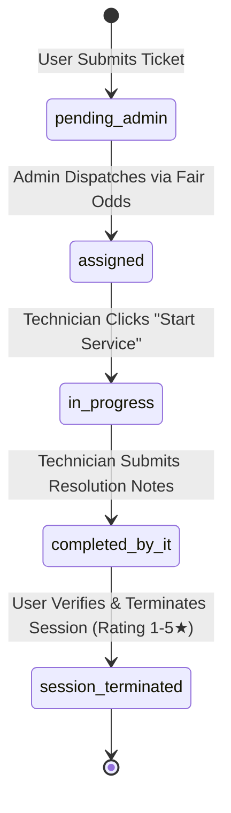
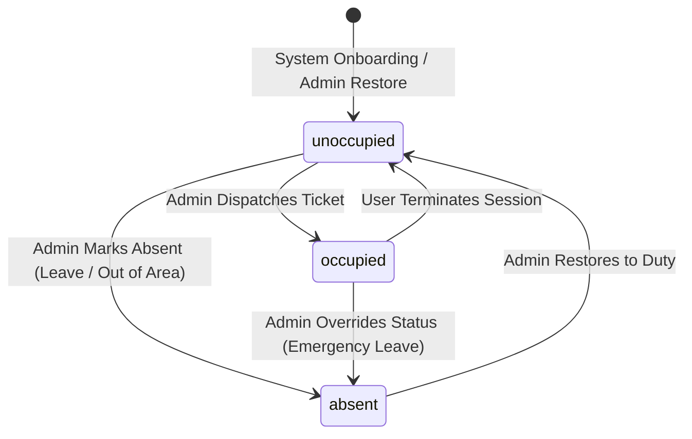
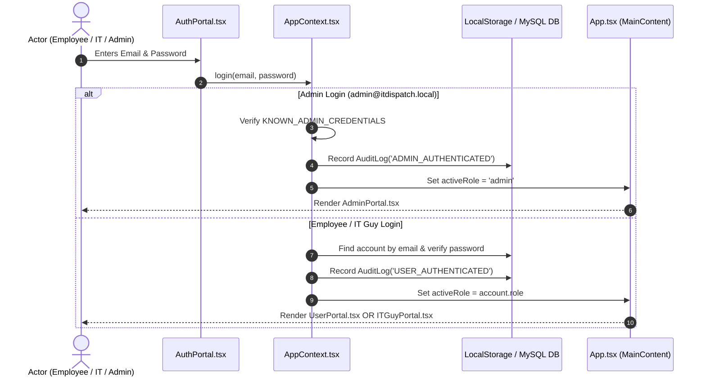
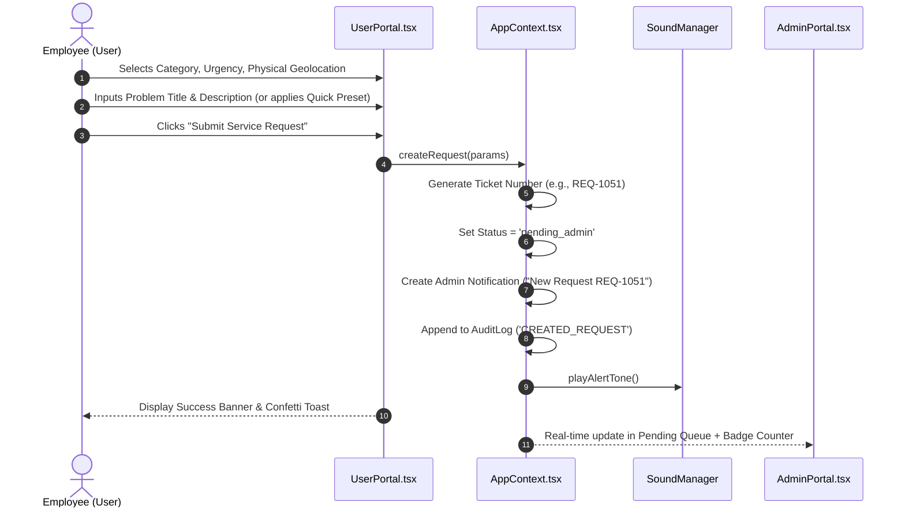
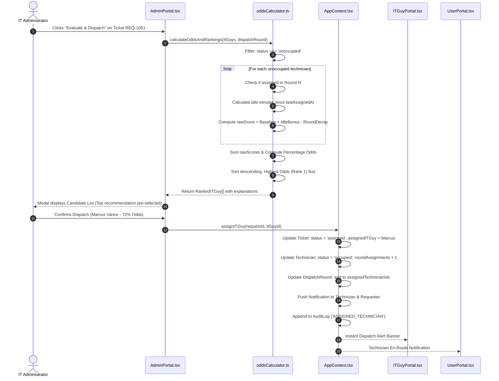
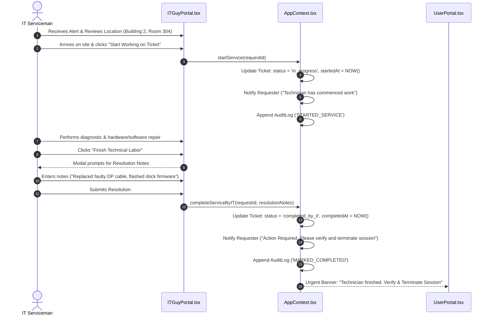
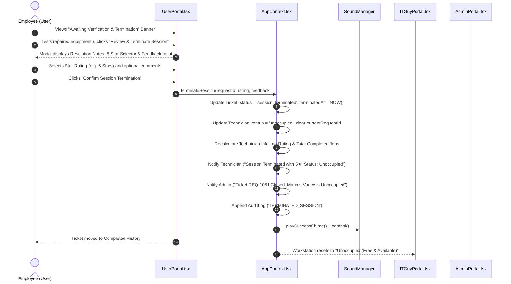
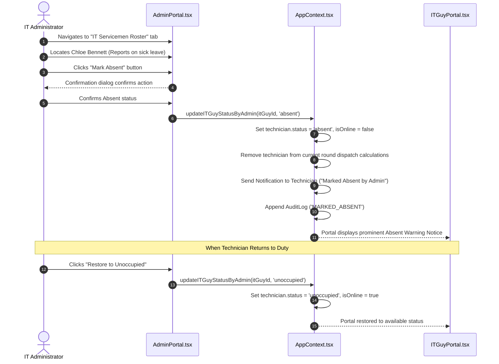

# IT SERVICE DISPATCH SYSTEM
## COMPREHENSIVE APPLICATION FLOW & INTERACTION DOCUMENTATION
**Document Version:** 2.0.0  
**Target Platform:** Enterprise Web & Mobile Responsive  
**Status:** Approved & Production-Ready  
**Related Components:** User Portal, Admin Portal, IT Serviceman Portal, Fair Odds Dispatch Engine  

---

## 1. Executive Summary & Operational Scope

The **IT Service Dispatch & Fair Iteration Management System** is an enterprise-grade service management platform designed to automate, optimize, and equitably govern internal IT support operations. Traditional IT service desks frequently suffer from:
1. **Technician Dispatch Fatigue & Favoritism:** Certain technicians are repeatedly assigned difficult or frequent tasks while others remain underutilized.
2. **Lack of Lifecycle Accountability:** Technicians mark jobs as complete without end-user verification, leading to premature ticket closure and unresolved tickets.
3. **Attendance & Availability Desynchronization:** Technicians on leave or out of the building are inadvertently assigned urgent tasks, causing critical downtime.

This application resolves these systemic issues through:
- **Fair Round-Robin Odds Allocation Engine:** A mathematical dispatch model that calculates dynamically decaying odds for previously assigned technicians while giving priority to technicians with longer idle times who have not yet served in the current round.
- **Closed-Loop Session Termination:** Technicians can only indicate that technical work is complete; only the requesting end-user holds the authority to "Terminate Session", provide a 1-to-5 star quality rating, and release the technician back into the available pool.
- **Supervisory Attendance Governance:** Strict administrative controls where only the single designated system Administrator can designate technicians as `absent` (out of service area) or restore them to `unoccupied`.
- **Strict Role-Gated Architecture:** Individual accounts are strictly separated into three distinct portals: Requester (`user`), Technician (`it_guy`), and Supervisor (`admin`), with robust server/client security preventing self-registration of administrative privileges.

---

## 2. Actor Personas & Access Boundaries

| Actor Role | Primary Identity | Core Permissions | Key Views & Portals |
| :--- | :--- | :--- | :--- |
| **Administrator** (`admin`) | Single Designated Account (`admin@itdispatch.local`) | Full system oversight; ticket reassignment; manual technician dispatch override; IT attendance management (`absent` / `unoccupied`); audit log review; MySQL database architecture inspector. | **Admin Command Center** (`AdminPortal.tsx`): KPI metrics, Pending dispatch queue, Serviceman roster, Global ticket monitor, Audit trail, MySQL schema manager. |
| **IT Serviceman** (`it_guy`) | Field Technical Engineers & Systems Specialists | View active dispatched assignment; accept & start service (`in_progress`); document technical resolution notes; submit completion for user review (`completed_by_it`); view personal performance metrics & ratings. | **Technician Field Station** (`ITGuyPortal.tsx`): Live dispatch alert card, active service execution console, completed job history, personal rating card. |
| **Service Requester** (`user`) | Corporate Employees & Department Staff | Submit IT service requests with category, urgency, and exact geolocation (Building, Floor, Room); track live ticket status; review technician resolution notes; **mandatorily terminate session** with star rating and feedback. | **Employee Request Hub** (`UserPortal.tsx`): Rapid ticket submission form with presets, active request tracking timeline, session termination modal, personal service history. |

---

## 3. Core State Machines & Lifecycles

### 3.1 Service Request Ticket State Machine

#### Ticket Status Definitions:
1. **`pending_admin`**: The request has been submitted by the employee and is queued in the Admin Command Center awaiting technician evaluation and assignment.
2. **`assigned`**: The Admin has assigned a specific technician based on the Fair Odds recommendation (or supervisory discretion). The technician is notified instantly.
3. **`in_progress`**: The technician has arrived on site or accessed the equipment remotely and clicked "Start Service" in their portal.
4. **`completed_by_it`**: Technical labor and repairs are finished. The technician has logged detailed resolution notes. The ticket now locks for the technician and awaits user verification.
5. **`session_terminated`**: The end-user has inspected the resolution, submitted their satisfaction rating (1–5 stars) and optional feedback, and closed the ticket. This action triggers the release of the technician back to `unoccupied`.

---

### 3.2 IT Serviceman Attendance & Duty State Machine

#### Technician Status Definitions:
1. **`unoccupied`**: Technician is on duty, physically present in the work area, and has no active tickets. They are fully eligible for odds calculation and dispatch.
2. **`occupied`**: Technician is currently dispatched to an active ticket (`assigned`, `in_progress`, or `completed_by_it`). They are strictly excluded from new ticket dispatches until the user terminates the session.
3. **`absent`**: Technician is on leave, off-site, sick, or attending training. **Only the Admin can assign or remove this status.** Absent technicians are completely excluded from odds calculations.

---

### 3.3 Dispatch Round-Robin Lifecycle

The system enforces an iterative round-robin cycle to guarantee equal distribution:
- Each cycle starts at **Round $N$** with a pool of eligible (non-absent) technicians.
- When an unoccupied technician is dispatched, their ID is appended to `assignedTechnicianIds` for Round $N$, and their `currentRoundAssignments` increments by 1.
- Their probability score drops dramatically for subsequent dispatches in Round $N$ compared to unassigned technicians.
- **Round Rollover Condition:** When every eligible technician in the roster has received an assignment ($\text{Eligible} \subseteq \text{AssignedInRound}$), the round counter increments to **Round $N+1$**, the `assignedTechnicianIds` set is emptied, all technicians' `currentRoundAssignments` reset to 0, and all unoccupied technicians return to baseline priority.

---

## 4. End-to-End Application Sequences & Step-by-Step Flows

### 4.1 Flow 1: Authentication & Access Control

#### Security Implementation Rules:
1. **Admin Exclusivity:** The Administrator account is singular and predefined (`adm-1`). Self-registration with `role = 'admin'` is strictly rejected with a security validation error.
2. **Self-Registration Allowed Roles:** New employees can register as `user` (requester), providing department, contact phone, and building/room. IT staff can register as `it_guy`, selecting their technical specialties (e.g., Hardware, Network, Audio/Visual).
3. **Session Persistence:** On page reload, the active session is securely restored from local storage or backend bearer tokens.

---

### 4.2 Flow 2: Service Request Creation Flow

#### Ticket Creation Constraints:
- Mandatory fields: Title (min 5 chars), Description (min 10 chars), Category (Hardware, Software, Network & WiFi, Printer & Peripherals, Access & Security, Audio/Visual), Urgency (Low, Medium, High, Critical), Building, Floor, Room.
- Pre-set templates are provided for common issues (e.g., "Monitor display blackout", "Conference room audio failure", "Color laser printer paper jam").

---

### 4.3 Flow 3: Fair Odds Calculation & Dispatch Flow

#### Algorithmic Odds Formula Summary:
- **Technician Unassigned in Current Round:**
  $$\text{Score} = 1000 + \min(\text{IdleMinutes} \times 2, 500)$$
- **Technician Already Assigned in Current Round:**
  $$\text{Score} = 50 + \min(\text{IdleMinutes} \times 0.2, 50)$$
- **Odds Percentage ($P_i$):**
  $$P_i = \frac{\text{Score}_i}{\sum \text{Score}} \times 100\%$$
- The candidate with the highest idle time who has not yet worked in the current round appears as **Rank #1 (Highest Odds)**.

---

### 4.4 Flow 4: IT Service Execution Flow

> **Crucial Rule:** The technician **CANNOT** mark the ticket as closed or terminate the session. The technician's status remains `occupied` until the user completes the termination step.

---

### 4.5 Flow 5: Session Termination & Technician Release Flow

---

### 4.6 Flow 6: Attendance & Absentee Management Flow

---

## 5. Summary of Key Interaction Rules

1. **Only the Admin** can assign tickets, change technician attendance (`absent` / `unoccupied`), and inspect audit logs.
2. **Only the User (Requester)** can terminate a session and release a technician.
3. **Only Unoccupied Technicians** are factored into odds calculations. Occupied and Absent technicians are bypassed.
4. **Odds Naturally Decay** once a technician receives a ticket in the current round, guaranteeing that other available technicians rise to the top of the queue.
5. **Auditing is Immutable:** Every critical transition (`CREATED_REQUEST`, `ASSIGNED_TECHNICIAN`, `STARTED_SERVICE`, `MARKED_COMPLETED`, `TERMINATED_SESSION`, `MARKED_ABSENT`) generates an audit log record with timestamps and actor identities.
