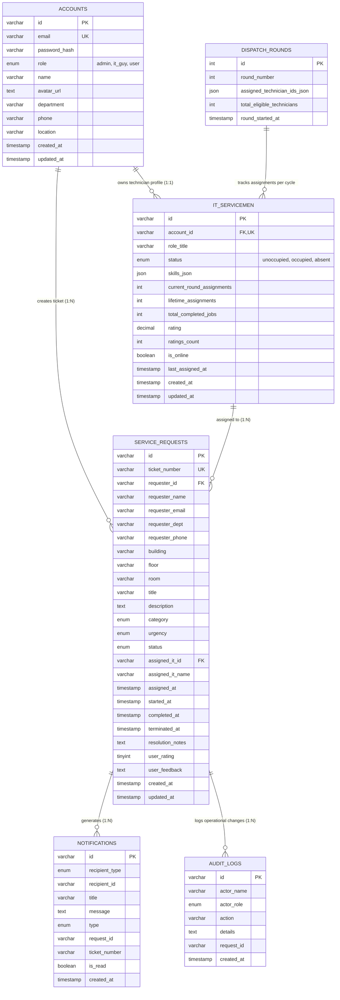
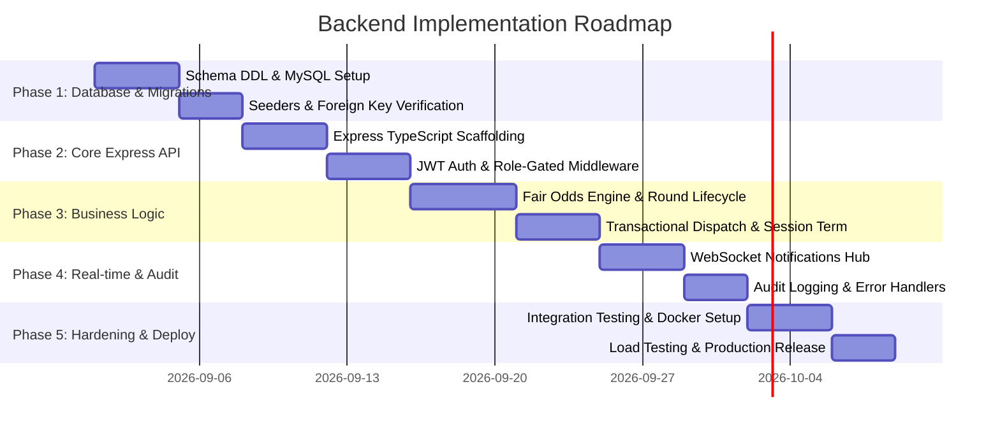

# IT SERVICE DISPATCH SYSTEM
## BACKEND SCHEMA & IMPLEMENTATION PLAN DOCUMENTATION
**Document Version:** 2.0.0  
**Target RDBMS:** MySQL 8.0+ / MariaDB 10.3+ (Engine: InnoDB)  
**Backend Framework:** Node.js / Express / TypeScript  
**Status:** Approved & Production-Ready  

---

## 1. Relational Database Architectural Principles

The IT Service Dispatch System database is architected to guarantee strict ACID compliance, data integrity, auditability, and zero race conditions during technician dispatch and session termination.

### 1.1 Core Engineering Constraints
1. **Engine:** `InnoDB` across all tables to support foreign key constraints, row-level locking, and transactional rollbacks.
2. **Character Set & Collation:** `utf8mb4` with `utf8mb4_unicode_ci` to support international names, technical symbols, and emoji in notes and feedback.
3. **Single Admin Constraint:** Exactly one authorized supervisor account has `role = 'admin'` (`adm-1`). Security policies reject self-registration of administrative privileges.
4. **Referential Integrity:** Service requests enforce foreign keys to both `accounts` (for the requester) and `it_servicemen` (for the assigned technician) with controlled cascading (`ON DELETE CASCADE` for requester account deletion, and `ON DELETE SET NULL` for technician references to preserve ticket history).
5. **High-Precision Timestamps:** Microsecond-resolution or ISO timestamps on key state transitions (`created_at`, `assigned_at`, `started_at`, `completed_at`, `terminated_at`) to enable accurate calculation of Mean Time to Dispatch (MTTD) and Mean Time to Resolution (MTTR).

---

## 2. Comprehensive Relational Schema Definition



---

### 2.1 Table Specifications

#### 2.1.1 Table 1: `accounts`
Stores all registered personas in the organization.

```sql
CREATE TABLE `accounts` (
  `id` VARCHAR(64) NOT NULL,
  `email` VARCHAR(191) NOT NULL,
  `password_hash` VARCHAR(255) NOT NULL,
  `role` ENUM('admin', 'it_guy', 'user') NOT NULL DEFAULT 'user',
  `name` VARCHAR(120) NOT NULL,
  `avatar_url` TEXT DEFAULT NULL,
  `department` VARCHAR(120) NOT NULL,
  `phone` VARCHAR(60) NOT NULL,
  `location` VARCHAR(255) NOT NULL,
  `created_at` TIMESTAMP NOT NULL DEFAULT CURRENT_TIMESTAMP,
  `updated_at` TIMESTAMP NOT NULL DEFAULT CURRENT_TIMESTAMP ON UPDATE CURRENT_TIMESTAMP,
  PRIMARY KEY (`id`),
  UNIQUE KEY `idx_accounts_email` (`email`)
) ENGINE=InnoDB DEFAULT CHARSET=utf8mb4 COLLATE=utf8mb4_unicode_ci;
```

#### 2.1.2 Table 2: `it_servicemen`
Contains operational metrics, skills, duty status, and fair-odds stats for field technicians.

```sql
CREATE TABLE `it_servicemen` (
  `id` VARCHAR(64) NOT NULL,
  `account_id` VARCHAR(64) NOT NULL,
  `role_title` VARCHAR(120) NOT NULL DEFAULT 'IT Systems Specialist',
  `status` ENUM('unoccupied', 'occupied', 'absent') NOT NULL DEFAULT 'unoccupied',
  `skills_json` JSON DEFAULT NULL,
  `current_round_assignments` INT UNSIGNED NOT NULL DEFAULT 0,
  `lifetime_assignments` INT UNSIGNED NOT NULL DEFAULT 0,
  `total_completed_jobs` INT UNSIGNED NOT NULL DEFAULT 0,
  `rating` DECIMAL(3,2) NOT NULL DEFAULT 5.00,
  `ratings_count` INT UNSIGNED NOT NULL DEFAULT 0,
  `is_online` BOOLEAN NOT NULL DEFAULT TRUE,
  `last_assigned_at` TIMESTAMP NULL DEFAULT NULL,
  `created_at` TIMESTAMP NOT NULL DEFAULT CURRENT_TIMESTAMP,
  `updated_at` TIMESTAMP NOT NULL DEFAULT CURRENT_TIMESTAMP ON UPDATE CURRENT_TIMESTAMP,
  PRIMARY KEY (`id`),
  UNIQUE KEY `idx_it_account` (`account_id`),
  KEY `idx_it_status` (`status`),
  CONSTRAINT `fk_it_account` FOREIGN KEY (`account_id`) REFERENCES `accounts` (`id`) ON DELETE CASCADE
) ENGINE=InnoDB DEFAULT CHARSET=utf8mb4 COLLATE=utf8mb4_unicode_ci;
```

#### 2.1.3 Table 3: `dispatch_rounds`
Maintains the iterative state of fair round-robin dispatch cycles.

```sql
CREATE TABLE `dispatch_rounds` (
  `id` INT UNSIGNED AUTO_INCREMENT NOT NULL,
  `round_number` INT UNSIGNED NOT NULL DEFAULT 1,
  `assigned_technician_ids_json` JSON NOT NULL,
  `total_eligible_technicians` INT UNSIGNED NOT NULL DEFAULT 0,
  `round_started_at` TIMESTAMP NOT NULL DEFAULT CURRENT_TIMESTAMP,
  PRIMARY KEY (`id`)
) ENGINE=InnoDB DEFAULT CHARSET=utf8mb4 COLLATE=utf8mb4_unicode_ci;
```

#### 2.1.4 Table 4: `service_requests`
Maintains end-user service requests through their entire lifecycle.

```sql
CREATE TABLE `service_requests` (
  `id` VARCHAR(64) NOT NULL,
  `ticket_number` VARCHAR(32) NOT NULL,
  `requester_id` VARCHAR(64) NOT NULL,
  `requester_name` VARCHAR(120) NOT NULL,
  `requester_email` VARCHAR(191) NOT NULL,
  `requester_dept` VARCHAR(120) NOT NULL,
  `requester_phone` VARCHAR(60) NOT NULL,
  `building` VARCHAR(80) NOT NULL,
  `floor` VARCHAR(40) NOT NULL,
  `room` VARCHAR(80) NOT NULL,
  `title` VARCHAR(255) NOT NULL,
  `description` TEXT NOT NULL,
  `category` ENUM('Hardware', 'Software', 'Network & WiFi', 'Printer & Peripherals', 'Access & Security', 'Audio/Visual') NOT NULL,
  `urgency` ENUM('low', 'medium', 'high', 'critical') NOT NULL DEFAULT 'medium',
  `status` ENUM('pending_admin', 'assigned', 'in_progress', 'completed_by_it', 'session_terminated') NOT NULL DEFAULT 'pending_admin',
  
  -- Assignment tracking
  `assigned_it_id` VARCHAR(64) DEFAULT NULL,
  `assigned_it_name` VARCHAR(120) DEFAULT NULL,
  `assigned_at` TIMESTAMP NULL DEFAULT NULL,
  `started_at` TIMESTAMP NULL DEFAULT NULL,
  `completed_at` TIMESTAMP NULL DEFAULT NULL,
  `terminated_at` TIMESTAMP NULL DEFAULT NULL,
  
  -- Resolution & feedback
  `resolution_notes` TEXT,
  `user_rating` TINYINT UNSIGNED DEFAULT NULL,
  `user_feedback` TEXT,
  
  `created_at` TIMESTAMP NOT NULL DEFAULT CURRENT_TIMESTAMP,
  `updated_at` TIMESTAMP NOT NULL DEFAULT CURRENT_TIMESTAMP ON UPDATE CURRENT_TIMESTAMP,
  PRIMARY KEY (`id`),
  UNIQUE KEY `idx_ticket_number` (`ticket_number`),
  KEY `idx_request_requester` (`requester_id`),
  KEY `idx_request_status` (`status`),
  KEY `idx_request_it_id` (`assigned_it_id`),
  CONSTRAINT `fk_request_requester` FOREIGN KEY (`requester_id`) REFERENCES `accounts` (`id`) ON DELETE CASCADE,
  CONSTRAINT `fk_request_it` FOREIGN KEY (`assigned_it_id`) REFERENCES `it_servicemen` (`id`) ON DELETE SET NULL
) ENGINE=InnoDB DEFAULT CHARSET=utf8mb4 COLLATE=utf8mb4_unicode_ci;
```

#### 2.1.5 Table 5: `notifications`
Real-time notification records delivered to specific users, technicians, or administrators.

```sql
CREATE TABLE `notifications` (
  `id` VARCHAR(64) NOT NULL,
  `recipient_type` ENUM('it_guy', 'admin', 'user', 'all') NOT NULL,
  `recipient_id` VARCHAR(64) NOT NULL,
  `title` VARCHAR(255) NOT NULL,
  `message` TEXT NOT NULL,
  `type` ENUM('dispatch', 'status_update', 'completion', 'termination', 'alert') NOT NULL,
  `request_id` VARCHAR(64) DEFAULT NULL,
  `ticket_number` VARCHAR(32) DEFAULT NULL,
  `is_read` BOOLEAN NOT NULL DEFAULT FALSE,
  `created_at` TIMESTAMP NOT NULL DEFAULT CURRENT_TIMESTAMP,
  PRIMARY KEY (`id`),
  KEY `idx_notif_recipient` (`recipient_type`, `recipient_id`),
  KEY `idx_notif_is_read` (`is_read`)
) ENGINE=InnoDB DEFAULT CHARSET=utf8mb4 COLLATE=utf8mb4_unicode_ci;
```

#### 2.1.6 Table 6: `audit_logs`
Append-only ledger of operational decisions.

```sql
CREATE TABLE `audit_logs` (
  `id` VARCHAR(64) NOT NULL,
  `actor_name` VARCHAR(120) NOT NULL,
  `actor_role` ENUM('admin', 'it_guy', 'user') NOT NULL,
  `action` VARCHAR(80) NOT NULL,
  `details` TEXT NOT NULL,
  `request_id` VARCHAR(64) DEFAULT NULL,
  `created_at` TIMESTAMP NOT NULL DEFAULT CURRENT_TIMESTAMP,
  PRIMARY KEY (`id`),
  KEY `idx_audit_action` (`action`),
  KEY `idx_audit_created` (`created_at`)
) ENGINE=InnoDB DEFAULT CHARSET=utf8mb4 COLLATE=utf8mb4_unicode_ci;
```

---

## 3. RESTful API Endpoint Specifications

### 3.1 Authentication Subsystem (`/api/auth`)

#### 1. `POST /api/auth/login`
- **Purpose:** Authenticate user or admin using email and password.
- **Request Body:**
  ```json
  {
    "email": "sarah.jenkins@acme-corp.com",
    "password": "password123"
  }
  ```
- **Response (200 OK):**
  ```json
  {
    "token": "eyJhbGciOiJIUzI1NiIsInR5cCI6IkpXVCJ9...",
    "account": {
      "id": "usr-1",
      "email": "sarah.jenkins@acme-corp.com",
      "role": "user",
      "name": "Sarah Jenkins",
      "department": "Financial Operations"
    }
  }
  ```

#### 2. `POST /api/auth/register`
- **Security Check:** Payload role must be `'user'` or `'it_guy'`. Any attempt to send `'admin'` returns HTTP `403 Forbidden`.
- **Request Body:**
  ```json
  {
    "name": "John Doe",
    "email": "john.doe@acme-corp.com",
    "password": "SecurePassword123!",
    "role": "user",
    "department": "Supply Chain",
    "phone": "+1 (555) 019-9944",
    "location": "Building 1 • Floor 3 • Room 310"
  }
  ```
- **Response (201 Created):** Returns user profile and authentication token.

---

### 3.2 Service Request Subsystem (`/api/requests`)

#### 1. `GET /api/requests`
- **Query Filters:** `?status=pending_admin&category=Hardware&page=1&limit=20`
- **Access:** Admin views all; IT Serviceman views assigned; Requester views own tickets.

#### 2. `POST /api/requests`
- **Access:** Requester (`user`).
- **Request Body:**
  ```json
  {
    "title": "Dual monitor HDMI display flickering",
    "description": "Second screen turns black every 3 minutes when compiling.",
    "category": "Hardware",
    "urgency": "high",
    "location": {
      "building": "Building 2",
      "floor": "Floor 3",
      "room": "Room 304"
    }
  }
  ```
- **Response (201 Created):** Returns new `ServiceRequest` with generated ticket number (e.g. `REQ-1051`).

#### 3. `PATCH /api/requests/:id/assign`
- **Access:** Admin ONLY.
- **Request Body:** `{ "itGuyId": "it-1" }`
- **Database Transaction (Atomicity Required):**
  1. `UPDATE service_requests SET status = 'assigned', assigned_it_id = 'it-1', assigned_at = NOW() WHERE id = :id AND status = 'pending_admin';`
  2. `UPDATE it_servicemen SET status = 'occupied', current_round_assignments = current_round_assignments + 1, lifetime_assignments = lifetime_assignments + 1, last_assigned_at = NOW() WHERE id = 'it-1';`
  3. `UPDATE dispatch_rounds SET assigned_technician_ids_json = JSON_ARRAY_APPEND(...) WHERE id = :currentRoundId;`
  4. `INSERT INTO audit_logs ...;`
  5. `INSERT INTO notifications ...;`

#### 4. `PATCH /api/requests/:id/start`
- **Access:** Assigned Technician (`it_guy`).
- **Action:** Changes ticket status from `'assigned'` to `'in_progress'`.

#### 5. `PATCH /api/requests/:id/complete`
- **Access:** Assigned Technician (`it_guy`).
- **Request Body:** `{ "resolutionNotes": "Replaced faulty DisplayPort cord and tested 4K 60Hz signal." }`
- **Action:** Changes ticket status from `'in_progress'` to `'completed_by_it'`.

#### 6. `PATCH /api/requests/:id/terminate`
- **Access:** Requester (`user`).
- **Request Body:** `{ "rating": 5, "feedback": "Marcus was fast, polite, and fixed the cable immediately." }`
- **Database Transaction (Atomicity Required):**
  1. `UPDATE service_requests SET status = 'session_terminated', user_rating = 5, user_feedback = :feedback, terminated_at = NOW() WHERE id = :id AND status = 'completed_by_it';`
  2. `UPDATE it_servicemen SET status = 'unoccupied', total_completed_jobs = total_completed_jobs + 1, rating = ((rating * ratings_count) + 5) / (ratings_count + 1), ratings_count = ratings_count + 1 WHERE id = :assignedItId;`
  3. Emit WebSocket / Notification event to notify technician and administrator.

---

### 3.3 Technicians & Odds Subsystem (`/api/technicians`)

#### 1. `GET /api/technicians/ranked`
- **Access:** Admin.
- **Calculates:** Active odds rankings using `oddsCalculator` algorithm across all unoccupied technicians.
- **Response (200 OK):**
  ```json
  [
    {
      "rank": 1,
      "itGuy": { "id": "it-1", "name": "Marcus Vance", "status": "unoccupied" },
      "oddsPercentage": 72,
      "priorityScore": 1280,
      "isHighestOdds": true,
      "explanation": "Top Recommendation: Fresh turn in Round 2 (idle 140m).",
      "hasBeenAssignedInCurrentRound": false,
      "timeSinceLastAssignedFormatted": "2h 20m"
    },
    {
      "rank": 2,
      "itGuy": { "id": "it-2", "name": "Elena Rostova", "status": "unoccupied" },
      "oddsPercentage": 28,
      "priorityScore": 510,
      "isHighestOdds": false,
      "explanation": "Already assigned in Round 2 (idle 25m).",
      "hasBeenAssignedInCurrentRound": true,
      "timeSinceLastAssignedFormatted": "25m"
    }
  ]
  ```

#### 2. `PATCH /api/technicians/:id/status`
- **Access:** Admin ONLY.
- **Request Body:** `{ "status": "absent" }` OR `{ "status": "unoccupied" }`
- **Behavior:** Updates technician availability; logs change to audit trail; dispatches alert to technician.

---

## 4. Phased Implementation Plan



### Phase 1: Database Provisioning & Migration (Days 1–7)
- Initialize MySQL 8.0+ instance with `utf8mb4` encoding.
- Execute `mysql_schema.sql` DDL definitions and verify InnoDB table constraints.
- Seed baseline Administrator (`adm-1`), initial technicians (`it-1` to `it-5`), and corporate requesters (`usr-1` to `usr-3`).

### Phase 2: Core Express.js API & Authentication (Days 8–15)
- Scaffold Node.js + Express + TypeScript project using `tsx` and ES modules.
- Implement bcrypt password hashing (12 rounds) and JWT signing with 24-hour expiration.
- Build Role-Based Access Control (RBAC) middleware (`requireRole('admin')`, `requireRole('it_guy')`, `requireRole('user')`).
- Strictly enforce the rule that rejects administrative self-registration.

### Phase 3: Dispatch Engine & Transactional Workflows (Days 16–24)
- Port `oddsCalculator.ts` logic into a reusable backend domain service.
- Wrap technician assignment in a MySQL ACID transaction with row-level locks (`SELECT ... FOR UPDATE`).
- Wrap session termination and rating updates in an atomic transaction to guarantee that technician release and rating calculations never desynchronize.
- Implement round-robin rollover triggers when all eligible technicians complete an assignment.

### Phase 4: Real-time Event Streaming & Audit Subsystem (Days 25–31)
- Implement WebSocket or Server-Sent Events (SSE) server for instant delivery of dispatch alerts, en-route notifications, and technician status changes.
- Connect notification dispatcher to sound triggers and front-end badge counters.
- Enforce immutable audit logging for all ticket state transitions and administrative attendance adjustments.

### Phase 5: Verification, Containerization, & Production Readiness (Days 32–38)
- Configure `Dockerfile` and `docker-compose.yml` orchestrating MySQL, Node API, and Vite frontend.
- Implement automated unit and integration tests (Jest / Vitest / Supertest) verifying edge cases:
  - Zero available technicians handling.
  - Concurrent dispatch race conditions.
  - Attempted unauthorized session terminations.
- Configure automated nightly MySQL database dumps (`mysqldump`) with backup rotation.
