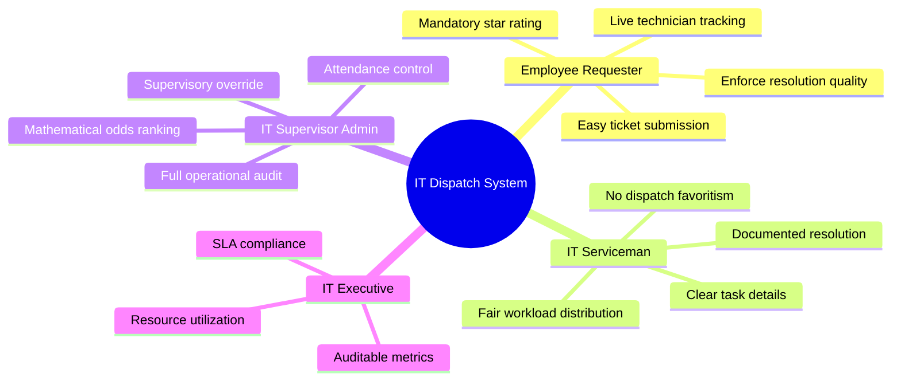

# IT SERVICE DISPATCH SYSTEM
## PRODUCT REQUIREMENT DOCUMENTATION (PRD)
**Document Version:** 2.0.0  
**Product Name:** IT Service Dispatch & Fair Iteration Management Platform  
**Target Release:** Enterprise Q4  
**Status:** Approved  
**Author:** IT Operations & Systems Architecture Group  

---

## 1. Product Overview & Strategic Objectives

### 1.1 Background & Context
In modern enterprises, the IT service desk is the operational backbone ensuring that hardware, networks, conference facilities, and software tools remain fully functional. However, standard IT ticketing platforms typically rely on either:
- **Manual "Cherry-Picking":** Technicians choose easy tickets, leaving difficult or remote requests unattended.
- **Unweighted Dispatch:** Dispatchers inadvertently overload specific "go-to" technicians, leading to burnout, technician turnover, and skewed performance metrics.
- **Premature Ticket Resolution:** Technicians close tickets without user confirmation, forcing users to submit duplicate tickets for unresolved problems.

### 1.2 Product Vision
The **IT Service Dispatch Platform** introduces algorithmic fairness and end-user accountability into enterprise support. By pairing an automated **Fair Round-Robin Odds Calculation Engine** with a **Mandatory User Session Termination** requirement, the system balances technician workload, prevents dispatch fatigue, and guarantees verified resolution of every technical request.

### 1.3 Strategic Business Goals
1. **Workload Equity:** Reduce variance in monthly assignments among active technicians to less than 10%.
2. **First-Contact Resolution Verification:** Achieve a 100% verified closure rate where tickets can only be terminated by the person who requested the service.
3. **Dispatch Velocity:** Decrease Mean Time to Dispatch (MTTD) from over 45 minutes to under 5 minutes.
4. **Transparency & Trust:** Provide a fully explainable, mathematical dispatch ranking visible to supervisors and an immutable audit log for every status transition.

---

## 2. User Personas & Stakeholder Analysis



### Persona 1: Sarah Jenkins — Corporate Employee (Requester)
- **Role:** Financial Operations Specialist (Building 2, Floor 3).
- **Pain Points:** Submits tickets and has no idea when someone will arrive; technicians often mark tickets "resolved" while the issue persists.
- **Needs:** Rapid submission with templates; real-time notifications when a technician is en route; authority to verify the fix before the ticket is closed.

### Persona 2: Marcus Vance — Senior Field IT Serviceman
- **Role:** Endpoints & Systems Support Specialist.
- **Pain Points:** Feels that some colleagues avoid difficult tickets; dislikes manual dispatch bias; wants recognized ratings for high-quality repairs.
- **Needs:** Predictable, fair assignment odds; focused mobile-friendly portal displaying ticket details and user contact info; transparent customer ratings.

### Persona 3: Alex Mercer — IT Operations Supervisor (Admin)
- **Role:** Director of IT Infrastructure & Help Desk Operations.
- **Pain Points:** Spends hours triaging tickets and manually deciding assignments; struggles to track which technicians are sick, on leave, or in another building.
- **Needs:** Algorithmic recommendation showing the best candidate; one-click dispatch; simple toggle to mark technicians absent or restore them to available; comprehensive audit trail.

---

## 3. Functional Requirements (Prioritized MoSCoW)

### 3.1 Authentication & Security Governance (Must Have)
- **PRD-FR-01 (Single Designated Admin):** The system must enforce that exactly one designated account possesses administrative rights (`admin@itdispatch.local`).
- **PRD-FR-02 (Privilege Escalation Prevention):** Registration forms must strictly forbid users from selecting the `admin` role. Users can only register as `user` (requester) or `it_guy` (technician).
- **PRD-FR-03 (Role-Gated Portal Routing):** Upon login, users must be automatically routed to their unique role view (`UserPortal`, `ITGuyPortal`, or `AdminPortal`). Cross-role interface bleed is strictly prohibited.

### 3.2 Service Request Management (Must Have)
- **PRD-FR-04 (Structured Ticket Submission):** Requesters can create tickets with Title, Description, Category (Hardware, Software, Network & WiFi, Printer & Peripherals, Access & Security, Audio/Visual), Urgency (Low, Medium, High, Critical), and exact location (Building, Floor, Room).
- **PRD-FR-05 (Quick Issue Presets):** The user interface must provide one-click presets for common corporate issues (e.g., dual monitor blackout, conference audio failure, printer jam).
- **PRD-FR-06 (Automated Ticket Numbering):** Tickets must receive a unique sequential identifier (e.g., `REQ-1051`) indexed for rapid searching.

### 3.3 Fair Round-Robin Odds Engine (Must Have)
- **PRD-FR-07 (Unoccupied Eligibility Filter):** Only technicians with status `unoccupied` can be included in odds calculations. Technicians who are `occupied` or `absent` are excluded.
- **PRD-FR-08 (Iterative Round Assignment Tracking):** The system must track which technicians have received an assignment in the active round ($N$).
- **PRD-FR-09 (Dynamic Odds Decay):** Technicians already dispatched in the current round must have their priority score reduced by an order of magnitude, ensuring technicians who have not yet served receive top priority.
- **PRD-FR-10 (Idle Time Bonus):** Technicians who have been unoccupied the longest without an assignment receive an idle-time bonus score.
- **PRD-FR-11 (Round Rollover):** When all non-absent technicians have received an assignment, the cycle increments to Round $N+1$, and all technicians reset to baseline priority.

### 3.4 Supervisory Dispatch Hub (Must Have)
- **PRD-FR-12 (Highest Odds Recommendation):** The Admin dispatch modal must display unoccupied technicians sorted strictly from highest odds to lowest odds, with the top candidate highlighted and pre-selected.
- **PRD-FR-13 (Explainable Odds Modal):** Supervisors and users can open an "Odds Engine" dialog that details the exact mathematical reasoning behind every candidate's ranking.
- **PRD-FR-14 (Supervisory Override):** Supervisors retain the discretion to select an alternative technician from the ranked list if specialized domain skills dictate.

### 3.5 Field Serviceman Console & Execution (Must Have)
- **PRD-FR-15 (Dispatched Assignment View):** Technicians receive a prominent dispatch alert containing requester name, phone, building, room, and problem description.
- **PRD-FR-16 (Start Service State Transition):** Technicians click "Start Working" to shift ticket status to `in_progress` and notify the requester.
- **PRD-FR-17 (Technical Completion & Resolution Notes):** Technicians must input technical notes detailing the corrective action before submitting the ticket for end-user verification (`completed_by_it`).

### 3.6 Closed-Loop User Verification & Session Termination (Must Have)
- **PRD-FR-18 (User Termination Authority):** Technicians are strictly prohibited from closing tickets. The ticket status can only transition to `session_terminated` by the requester.
- **PRD-FR-19 (Mandatory 1–5 Star Rating):** Requesters must submit a 1-to-5 star rating and optional qualitative feedback during session termination.
- **PRD-FR-20 (Technician Release Trigger):** Submitting session termination instantly changes the technician's status from `occupied` back to `unoccupied`, recalculates their average customer rating, and enables them for new dispatches.

### 3.7 Attendance & Absentee Management (Must Have)
- **PRD-FR-21 (Admin Attendance Toggle):** The Admin portal must provide controls on the Serviceman Roster to mark any technician `absent` (out of area / on leave) or restore them to `unoccupied`.
- **PRD-FR-22 (Technician Absentee Lock):** Technicians marked absent see a persistent advisory banner informing them that their account is on leave and will not receive dispatches until restored by the Admin.

### 3.8 Notification & Audio System (Should Have)
- **PRD-FR-23 (Real-time Notification Inbox):** Users, technicians, and administrators receive targeted notifications with unread badge indicators.
- **PRD-FR-24 (Synthesized Web Audio Cues):** State transitions emit distinct audio tones (success chime, dispatch alert, warning beep) using the browser Web Audio API without external audio file dependencies.

### 3.9 Audit Trail & Diagnostics (Should Have)
- **PRD-FR-25 (Immutable Audit Ledger):** Every authentication event, ticket dispatch, attendance toggle, and session termination must be recorded in an immutable audit log.
- **PRD-FR-26 (MySQL Schema Inspector):** The Admin console must include a tab allowing the supervisor to review, copy, and download the full MySQL 8.0 DDL schema script.

---

## 4. Non-Functional Requirements (NFR)

| Category | Identifier | Metric / Standard | Description |
| :--- | :--- | :--- | :--- |
| **Performance** | NFR-PERF-01 | Latency < 100ms | Odds calculation across 100+ technicians must execute in under 100 milliseconds. |
| **Performance** | NFR-PERF-02 | Page Load < 1.5s | Client application initial load time must not exceed 1.5 seconds on standard 4G connections. |
| **Reliability** | NFR-REL-01 | Zero Data Loss | Database transactions for ticket dispatch and session termination must be fully atomic (`InnoDB`). |
| **Security** | NFR-SEC-01 | Strict RBAC | Zero unauthorized privilege escalation; role checks executed both on the frontend context and backend API routes. |
| **Security** | NFR-SEC-02 | Password Encryption | Passwords hashed using bcrypt with salt work factor of at least 12. |
| **Accessibility** | NFR-A11Y-01 | WCAG 2.1 AA | Interface must achieve high visual contrast, full keyboard focus states, and screen-reader accessible ARIA tags. |
| **Portability** | NFR-PORT-01 | Responsive Layout | Seamless experience across desktop (1920x1080), laptop (1366x768), and mobile devices (375x812). |

---

## 5. User Journey Maps

### 5.1 The Requester Journey: Sarah's Broken Monitor
```
[Arrive at Desk] -> [Second Monitor Dead] -> [Open IT Portal] 
       |
[Click "Monitor Blackout" Preset] -> [Location Auto-filled: Bldg 2, Flr 3, Rm 304]
       |
[Click "Submit Service Request"] -> [Real-time Status: "Pending Admin Evaluation"]
       |
[Notification: "Marcus Vance Dispatched (72% Odds)"] -> [Status: "Assigned"]
       |
[Marcus Arrives on Site] -> [Status: "In Progress"]
       |
[Marcus Finishes Cable Replacement] -> [Status: "Completed by IT (Awaiting Verification)"]
       |
[Sarah Tests Dual Monitors at 4K 60Hz] -> [Clicks "Review & Terminate Session"]
       |
[Rates 5 Stars: "Fixed in 10 minutes!"] -> [Confetti Burst + Marcus Released to Unoccupied]
```

### 5.2 The Supervisor Journey: Alex Managing Morning Rush
```
[Alex Logs In as Admin] -> [Views Dashboard: 4 Requests Pending, 3 Unoccupied Techs]
       |
[Clicks Ticket REQ-1048] -> [Modal Opens: Marcus Vance Recommended at 72% Odds]
       |
[Confirms Dispatch] -> [Ticket Assigned, Marcus Status Changed to Occupied]
       |
[Roster Review: Elena reports sick] -> [Alex clicks "Mark Absent" on Elena]
       |
[Elena excluded from Round 1 odds pool] -> [All metrics recalculate dynamically]
```

---

## 6. Success Metrics & KPIs

1. **Equitable Distribution Index:** Standard deviation of ticket assignments among technicians within the same shift must decrease by at least 60% compared to manual dispatch desks.
2. **First-Time Right Rate:** Greater than 96% of tickets terminated without reopening or secondary ticket creation within 48 hours.
3. **Customer Satisfaction (CSAT):** Average user rating maintained above 4.7 out of 5.0 stars across all departments.
4. **Session Termination Compliance:** Over 95% of tickets formally closed by end-users within 24 hours of technical completion.
