# IT SERVICE DISPATCH SYSTEM
## SYSTEM REQUIREMENT SPECIFICATIONS (SRS)
**Document Standard:** IEEE 830 / ISO/IEC/IEEE 29148 Compliant  
**Document Version:** 2.0.0  
**Product Name:** IT Service Dispatch & Fair Iteration Management Platform  
**Target Environment:** Cross-Platform Web & Mobile Responsive  
**Status:** Approved & Implemented  
**Date:** September 2026  

---

## 1. Introduction

### 1.1 Purpose
This System Requirement Specifications (SRS) document provides a comprehensive, rigorous technical specification for the **IT Service Dispatch & Fair Iteration Management System**. It formally defines the functional capabilities, external interfaces, performance thresholds, security constraints, and quality attributes required for enterprise production deployment.

### 1.2 Document Conventions
- **MUST / SHALL:** Mandatory requirements that must be satisfied by the implementation.
- **SHOULD / RECOMMENDED:** Strongly advised features reflecting best architectural practices.
- **MAY / OPTIONAL:** Permissible features that enhance usability without impacting core integrity.
- **Identified Actors:**
  - `Admin`: Designated IT Infrastructure and Operations Supervisor.
  - `Technician` (`it_guy`): Field IT systems specialist and repair engineer.
  - `Requester` (`user`): Organizational employee requesting technical assistance.

### 1.3 Intended Audience
This document is prepared for:
1. **Software Engineers & System Architects:** For system implementation, data modeling, and API integration.
2. **Quality Assurance (QA) Engineers:** For creating test plans, traceability matrices, and automated regression suites.
3. **IT Operations & Infrastructure Leadership:** For deployment, security auditing, and compliance verification.
4. **Product Stakeholders:** For functional verification against business requirements.

### 1.4 Product Scope & High-Level Overview
The system is an enterprise-grade service management platform designed to automate and govern organizational IT support operations. It eliminates dispatch favoritism, prevents technician fatigue, guarantees that tickets are verified by end-users before closure, and synchronizes technician attendance with real-time dispatch calculations.

### 1.5 References
- **IEEE Std 830-1998:** IEEE Recommended Practice for Software Requirements Specifications.
- **ISO/IEC 25010:** Systems and Software Quality Requirements and Evaluation (SQuaRE).
- **MySQL 8.0 Reference Manual:** Relational Database Constraints and InnoDB Storage Engine.
- **W3C Web Content Accessibility Guidelines (WCAG) 2.1:** Level AA Compliance.
- **RFC 7519:** JSON Web Token (JWT) Standard.

---

## 2. Overall Description

### 2.1 Product Perspective & Context
The IT Service Dispatch System operates as a mission-critical web application serving all departments within an organization. It interacts with three external tiers:
1. **Client Tier:** Web browsers (Chrome, Edge, Firefox, Safari) across desktop workstations and mobile technician devices.
2. **Application Tier:** Node.js / Express.js REST API layer executing business logic, authentication, and the Fair Odds Engine.
3. **Data Tier:** MySQL 8.0+ / MariaDB 10.3+ database enforcing referential integrity and ACID transactions via InnoDB.

```mermaid
graph TB
    subgraph Client Tier
        W_User[Requester Browser (Desktop/Mobile)]
        W_Tech[Technician Mobile Device]
        W_Admin[Supervisor Workstation]
    end

    subgraph Application Tier [Node.js / Express / TypeScript]
        AuthModule[Authentication & RBAC Guard]
        OddsEngine[Fair Round-Robin Odds Engine]
        DispatchMgr[Transactional Dispatch Manager]
        AudioSynth[Web Audio Synthesis Subsystem]
        AuditMgr[Audit Logging & Notification Broker]
    end

    subgraph Data Tier [MySQL 8.0+ / InnoDB]
        DB[(it_dispatch_db)]
    end

    W_User --> AuthModule
    W_Tech --> AuthModule
    W_Admin --> AuthModule

    AuthModule --> DispatchMgr
    AuthModule --> OddsEngine
    DispatchMgr --> AuditMgr
    DispatchMgr --> DB
    AuditMgr --> DB
```

### 2.2 Product Functions
1. **Strict Role-Gated Access Control:** Enforces single designated administrator governance (`admin@itdispatch.local`) and strictly blocks self-registration of administrative privileges.
2. **Service Request Ingestion:** Captures detailed incident data including Title, Description, Category, Urgency, and exact Physical Geolocation (Building, Floor, Room).
3. **Fair Round-Robin Odds Calculation:** Dynamically ranks unoccupied technicians using an explainable mathematical formula combining idle time bonuses with round decay factors.
4. **Supervisory Dispatch Hub:** Displays sorted technician odds recommendations with one-click assignment and supervisor override capabilities.
5. **Technician Field Execution:** Mobile-ready console supporting step-by-step task progression (`assigned` $\rightarrow$ `in_progress` $\rightarrow$ `completed_by_it`) with mandatory technical resolution notes.
6. **Closed-Loop User Session Termination:** Ticket closure is strictly gated on the requesting user's verification, accompanied by a mandatory 1-to-5 star rating and feedback.
7. **Attendance & Absentee Governance:** Admin-exclusive controls to toggle technicians between `absent` and `unoccupied`, dynamically adjusting the active dispatch pool.
8. **Real-time Event Notifications & Procedural Audio:** Live in-app notifications paired with zero-dependency browser-synthesized audio cues.
9. **Immutable Operational Audit Trail:** High-precision logging of all system state transitions.

### 2.3 User Classes and Characteristics

| User Class | Frequency of Use | Technical Expertise | System Rights |
| :--- | :--- | :--- | :--- |
| **Requester User** (`user`) | Intermittent (incident-based) | Novice to Intermediate | Create tickets; track own tickets; review technician resolution; terminate session; rate technician. |
| **IT Serviceman** (`it_guy`) | Continuous throughout shift | Advanced Technical | View assigned ticket; start work; log resolution notes; mark technical completion; view personal rating. |
| **Administrator** (`admin`) | Continuous (operational hours) | Expert / System Supervisor | Global dispatch control; attendance management; ticket overrides; audit log inspection; schema diagnostics. |

### 2.4 Operating Environment
- **Client Hardware:** Standard workstations, laptops, tablets, and smartphones with minimum display resolution of 375 $\times$ 667 pixels.
- **Supported Browsers:** Google Chrome $\ge$ 115, Mozilla Firefox $\ge$ 115, Apple Safari $\ge$ 16, Microsoft Edge $\ge$ 115.
- **Server Operating System:** Linux (Ubuntu 22.04 LTS+, Debian 12+, RHEL 9+) or Windows Server 2022.
- **RDBMS Engine:** MySQL 8.0.28+ or MariaDB 10.6+ running InnoDB storage engine with `utf8mb4` encoding.
- **Runtime Environment:** Node.js 18.x LTS, 20.x LTS, or 22.x LTS.

### 2.5 Design & Implementation Constraints
1. **Single Admin Account Invariant:** The system must strictly restrict the `admin` role to a single designated account (`adm-1`). The registration interface must strictly prohibit selecting the `admin` role.
2. **Zero Premature Closure Constraint:** Technicians must have no technical ability to set ticket status to `session_terminated`. Only the requester can trigger ticket closure.
3. **Atomicity Constraint:** Dispatching a technician and advancing dispatch rounds must occur inside an atomic database transaction.
4. **Asset-Free Audio Constraint:** Audio feedback must not rely on external audio files; all chimes must be synthesized procedurally via HTML5 `AudioContext`.

---

## 3. External Interface Requirements

### 3.1 User Interfaces (UI)
- The user interface must be structured using modern CSS utilities (Tailwind CSS v4) with an *Orbit Dark Modern* theme (`bg-slate-950`).
- Interface components must be fully reactive, incorporating hardware-accelerated animations (`motion/react`) with spring physics for modal entry and exit.
- Color cues must strictly follow semantic tokens: Emerald for available/unoccupied, Amber for busy/occupied, Rose for absent/critical, and Indigo for primary actions.

### 3.2 Hardware Interfaces
- The application requires no proprietary hardware interfaces. It leverages standard input devices (keyboard, mouse, touchscreen) and audio output devices (speakers, headphones) via standard browser APIs.

### 3.3 Software Interfaces
1. **Relational Database Management System:**
   - Protocol: MySQL Client/Server Protocol via TCP/IP (default port 3306).
   - Driver: `mysql2/promise` with connection pooling (minimum 5, maximum 20 connections).
2. **Browser APIs:**
   - HTML5 `AudioContext`: Procedural waveform synthesis for auditory feedback.
   - HTML5 `localStorage`: Secure client-side cache and session persistence.
   - HTML5 `Canvas`: Particle physics rendering for session termination celebration.

### 3.4 Communications Interfaces
- **HTTP / HTTPS:** RESTful communication over TLS 1.3 / HTTPS on port 443 (or port 3000 in development).
- **Data Exchange Format:** All request and response bodies must adhere to `application/json` format with `utf-8` encoding.
- **Error Format:** API errors must adhere to RFC 7807 (Problem Details for HTTP APIs) containing `type`, `title`, `status`, and `detail`.

---

## 4. Detailed System Features & Functional Requirements

```mermaid
stateDiagram-v2
    direction LR
    [*] --> Pending: Requester Creates Ticket
    Pending --> Assigned: Admin Dispatches via Fair Odds
    Assigned --> InProgress: Technician Starts Service
    InProgress --> CompletedByIT: Technician Logs Resolution
    CompletedByIT --> SessionTerminated: Requester Rates & Terminates
    SessionTerminated --> [*]
```



### 4.1 Feature 1: Authentication & Identity Governance

#### 4.1.1 Description
Provides secure authentication, session management, and role-based portal routing for Requesters, Technicians, and the Supervisor.

#### 4.1.2 Functional Requirements
- **SRS-FR-01.1 (Credential Verification):** The system SHALL authenticate users against stored email and bcrypt password hashes.
- **SRS-FR-01.2 (Single Admin Restriction):** Exactly ONE designated account SHALL possess the `admin` role (`admin@itdispatch.local`).
- **SRS-FR-01.3 (Registration Security Guard):** The registration endpoint SHALL strictly reject any registration payload specifying `role = 'admin'` with HTTP 403 Forbidden.
- **SRS-FR-01.4 (Role-Gated Routing):** Upon successful authentication, the system SHALL render only the specific portal corresponding to the authenticated account's role (`UserPortal`, `ITGuyPortal`, or `AdminPortal`).
- **SRS-FR-01.5 (Audit Logging of Auth):** Every successful login and logout event SHALL be recorded in the `audit_logs` table.

---

### 4.2 Feature 2: Service Request Submission & Geolocation

#### 4.2.1 Description
Enables employees to log technical incidents with structured metadata and exact room-level geolocation.

#### 4.2.2 Functional Requirements
- **SRS-FR-02.1 (Mandatory Field Validation):** The system SHALL validate that requests contain a non-empty Title (min 5 chars), Description (min 10 chars), Category, Urgency, Building, Floor, and Room.
- **SRS-FR-02.2 (Category Standardization):** Categories SHALL be restricted to: `Hardware`, `Software`, `Network & WiFi`, `Printer & Peripherals`, `Access & Security`, and `Audio/Visual`.
- **SRS-FR-02.3 (Urgency Levels):** Urgency SHALL support: `low`, `medium`, `high`, and `critical`.
- **SRS-FR-02.4 (Ticket Number Sequencing):** The system SHALL automatically generate a unique, sequential ticket number with the format `REQ-XXXX` (e.g., `REQ-1051`).
- **SRS-FR-02.5 (Supervisor Notification):** Submitting a ticket SHALL immediately trigger a high-priority notification to the Admin Command Center and emit an audible alert ping.

---

### 4.3 Feature 3: Fair Round-Robin Odds Calculation Engine

#### 4.3.1 Description
Calculates mathematically equitable dispatch probabilities across all available technicians to eliminate dispatch fatigue and favoritism.

#### 4.3.2 Mathematical Formulation
Let $E = \{t_1, t_2, \dots, t_K\}$ be the set of technicians with status `unoccupied`.
For each candidate $t_i$:
1. Determine idle time in minutes $M_i = \max(0, \lfloor(\tau_{\text{current}} - \tau_{\text{last}}(t_i)) / 60000\rfloor)$.
2. If technician has NOT been assigned in current round ($H_i = \text{false}$):
   $$S_i = 1000 + \min(2 \times M_i, 500)$$
3. If technician HAS already been assigned in current round ($H_i = \text{true}$):
   $$S_i = 50 + \min(0.2 \times M_i, 50)$$
4. Compute normalized percentage odds:
   $$P_i = \frac{S_i}{\sum_{k \in E} S_k} \times 100\%$$

#### 4.3.3 Functional Requirements
- **SRS-FR-03.1 (Status Filtering):** Technicians with status `occupied` or `absent` SHALL be strictly excluded from odds calculation.
- **SRS-FR-03.2 (Sorting Order):** The candidate list SHALL be sorted in strict descending order of priority score ($S_i$), with Rank #1 designated as "Highest Odds".
- **SRS-FR-03.3 (Explainability Metadata):** Each ranked candidate SHALL include an algorithmic explanation string describing their idle time and round assignment history.
- **SRS-FR-03.4 (Round Boundary Rollover):** When all non-absent technicians have received at least one assignment in Round $N$, the system SHALL increment the round counter to $N+1$, reset all `current_round_assignments` to 0, and clear the assigned IDs list.

---

### 4.4 Feature 4: Supervisory Dispatch Hub

#### 4.4.1 Description
Provides the Administrator with an overview of pending requests, algorithmic recommendations, and one-click dispatch controls.

#### 4.4.2 Functional Requirements
- **SRS-FR-04.1 (Pre-selection of Top Candidate):** When opening the dispatch modal, the system SHALL automatically highlight and pre-select the technician holding Rank #1.
- **SRS-FR-04.2 (Supervisory Override):** The administrator SHALL retain the authority to select any eligible technician from the ranked candidate list.
- **SRS-FR-04.3 (Atomic Dispatch Transaction):** Upon dispatch confirmation, the system SHALL atomically:
  1. Set request status to `assigned` and record `assigned_it_id` and `assigned_at`.
  2. Set technician status to `occupied` and increment `current_round_assignments` and `lifetime_assignments`.
  3. Append technician ID to `dispatch_rounds.assigned_technician_ids_json`.
  4. Write an entry to `audit_logs`.
  5. Dispatch notifications to both the assigned technician and the requester.

---

### 4.5 Feature 5: Field Technician Execution Console

#### 4.5.1 Description
Provides technicians with an operational workstation to receive assignments, initiate service, and log technical resolutions.

#### 4.5.2 Functional Requirements
- **SRS-FR-05.1 (Active Assignment Banner):** The technician portal SHALL prominently display active task details including requester contact, phone, building, floor, room, and problem summary.
- **SRS-FR-05.2 (Service Start Action):** The technician SHALL have a control to mark work initiated, transitioning ticket status to `in_progress` and capturing `started_at`.
- **SRS-FR-05.3 (Mandatory Resolution Notes):** Before marking technical labor complete, the technician MUST enter detailed notes describing corrective measures taken.
- **SRS-FR-05.4 (Technical Completion State):** Submitting resolution notes SHALL transition ticket status to `completed_by_it`, record `completed_at`, and send an urgent verification alert to the requester.
- **SRS-FR-05.5 (Prohibition of Direct Ticket Closure):** Technicians SHALL NOT be permitted to close tickets or reset their own status to `unoccupied`.

---

### 4.6 Feature 6: Closed-Loop Verification & Session Termination

#### 4.6.1 Description
Empowers the requester to verify the quality of technical work, provide a satisfaction rating, and formally terminate the session.

#### 4.6.2 Functional Requirements
- **SRS-FR-06.1 (Requester Closure Authority):** The action to terminate a session SHALL be restricted exclusively to the user who created the ticket.
- **SRS-FR-06.2 (Mandatory Star Rating):** The termination modal SHALL require the user to submit a rating between 1 and 5 stars.
- **SRS-FR-06.3 (Technician Release):** Executing session termination SHALL atomically:
  1. Set ticket status to `session_terminated` and record `terminated_at`, `user_rating`, and `user_feedback`.
  2. Transition the assigned technician's status from `occupied` back to `unoccupied`.
  3. Recalculate the technician's lifetime average rating:
     $$\text{Rating}_{\text{new}} = \frac{(\text{Rating}_{\text{old}} \times N_{\text{ratings}}) + \text{Rating}_{\text{given}}}{N_{\text{ratings}} + 1}$$
  4. Increment the technician's `total_completed_jobs` count by 1.
- **SRS-FR-06.4 (Celebration Effects):** Session termination SHALL trigger a confetti particle animation and a synthesized 4-note ascending success chime.

---

### 4.7 Feature 7: Administrative Attendance & Absentee Management

#### 4.7.1 Description
Enables the Administrator to manage technician duty availability, ensuring absent personnel are never assigned tickets.

#### 4.7.2 Functional Requirements
- **SRS-FR-07.1 (Attendance Toggles):** The Admin portal SHALL provide controls on the Serviceman Roster to set any technician's status to `absent` or `unoccupied`.
- **SRS-FR-07.2 (Immediate Dispatch Exclusion):** Technicians marked `absent` SHALL be instantly excluded from all odds calculations and dispatch pools.
- **SRS-FR-07.3 (Absentee Portal Lockout):** When an absent technician accesses their portal, the system SHALL display a prominent notice stating that their account is marked absent and dispatches are paused.
- **SRS-FR-07.4 (Restoration to Duty):** When an administrator restores an absent technician to `unoccupied`, their eligibility in the active dispatch round SHALL be reinstated immediately.

---

### 4.8 Feature 8: Notification Delivery & Procedural Audio

#### 4.8.1 Functional Requirements
- **SRS-FR-08.1 (Targeted Inbox):** The system SHALL maintain a dedicated notification inbox for each account, supporting `is_read` filtering and a badge counter.
- **SRS-FR-08.2 (Procedural Audio Synthesis):** The client application SHALL generate audio tones using the Web Audio API without fetching external media files:
  - *Success Chime:* Arpeggiated C5 (523.25 Hz), E5 (659.25 Hz), G5 (783.99 Hz), C6 (1046.50 Hz).
  - *Dispatch Chime:* Dual-tone chord at 349.23 Hz and 440.00 Hz.
  - *Alert Tone:* Single resonant ping at 880.00 Hz.

---

### 4.9 Feature 9: Immutable Audit Logging

#### 4.9.1 Functional Requirements
- **SRS-FR-09.1 (Immutable Append-Only Log):** The `audit_logs` table SHALL NOT support update or delete operations under standard application execution.
- **SRS-FR-09.2 (Audited Events):** The system SHALL record entries for: `USER_AUTHENTICATED`, `ADMIN_AUTHENTICATED`, `CREATED_REQUEST`, `ASSIGNED_TECHNICIAN`, `STARTED_SERVICE`, `MARKED_COMPLETED`, `TERMINATED_SESSION`, `MARKED_ABSENT`, and `MARKED_UNOCCUPIED`.

---

## 5. Non-Functional & Quality Requirements (ISO/IEC 25010)

### 5.1 Performance Requirements
- **NFR-PERF-01 (Odds Compute Latency):** Calculating odds and ranking across 500 technicians SHALL complete in $< 10$ milliseconds.
- **NFR-PERF-02 (API Response Time):** 95% of API requests (`GET`, `POST`, `PATCH`) SHALL return in $< 150$ milliseconds under a load of 100 concurrent users.
- **NFR-PERF-03 (Client Bundle Size):** Production frontend bundle size SHALL not exceed 350 KB gzipped.

### 5.2 Reliability & ACID Integrity
- **NFR-REL-01 (ACID Compliance):** All ticket assignment and session termination mutations SHALL be executed within database transactions with rollback capability on error.
- **NFR-REL-02 (Availability):** The application SHALL achieve an operational availability target of 99.9% uptime during business hours.

### 5.3 Security Requirements
- **NFR-SEC-01 (Password Protection):** Passwords SHALL be hashed using bcrypt with a work factor of $\ge 12$. Plaintext passwords SHALL never be logged or persisted.
- **NFR-SEC-02 (Zero Privilege Escalation):** Administrative authorization checks SHALL be enforced at both the client routing layer and the server API middleware layer.
- **NFR-SEC-03 (Input Sanitization):** All textual user inputs SHALL be escaped to eliminate Cross-Site Scripting (XSS) risks. Database queries SHALL use parameterized placeholders to eliminate SQL Injection (SQLi).

### 5.4 Usability & Accessibility
- **NFR-USE-01 (WCAG 2.1 AA Compliance):** All text elements SHALL maintain a minimum contrast ratio of 4.5:1 against their backgrounds.
- **NFR-USE-02 (Keyboard Accessibility):** All modal dialogs, buttons, and form inputs SHALL be navigable and executable via standard keyboard controls (`Tab`, `Enter`, `Space`, `Escape`).

---

## 6. Data Dictionary & Relational Entity Specifications

| Table Name | Primary Key | Foreign Keys | Engine | Collation | Description |
| :--- | :--- | :--- | :--- | :--- | :--- |
| `accounts` | `id` (VARCHAR 64) | None | InnoDB | `utf8mb4_unicode_ci` | Authenticated users across roles (`admin`, `it_guy`, `user`). Unique index on `email`. |
| `it_servicemen` | `id` (VARCHAR 64) | `account_id` $\rightarrow$ `accounts(id)` | InnoDB | `utf8mb4_unicode_ci` | Operational metrics, duty status (`unoccupied`, `occupied`, `absent`), skills, and ratings. |
| `dispatch_rounds` | `id` (INT AUTO) | None | InnoDB | `utf8mb4_unicode_ci` | Round iteration number and assigned technician IDs array. |
| `service_requests` | `id` (VARCHAR 64) | `requester_id` $\rightarrow$ `accounts(id)`, `assigned_it_id` $\rightarrow$ `it_servicemen(id)` | InnoDB | `utf8mb4_unicode_ci` | Incident tickets, category, urgency, location, timestamps, resolution notes, and ratings. |
| `notifications` | `id` (VARCHAR 64) | None | InnoDB | `utf8mb4_unicode_ci` | Real-time targeted alerts and dispatch notifications. |
| `audit_logs` | `id` (VARCHAR 64) | None | InnoDB | `utf8mb4_unicode_ci` | Append-only ledger recording all actor actions with timestamps. |

---

## 7. Requirements Traceability Matrix (RTM)

| Business Need | Functional Req ID | System Feature | Implementation Module | Verification Method |
| :--- | :--- | :--- | :--- | :--- |
| Single Admin Governance | SRS-FR-01.2, 01.3 | Authentication | `AuthPortal.tsx`, `AppContext.tsx` | Automated Security Unit Test |
| Incident Location Accuracy | SRS-FR-02.1, 02.2 | Request Submission | `UserPortal.tsx` | Form Validation Test |
| Workload Equity & Fair Odds | SRS-FR-03.1–03.4 | Fair Odds Engine | `oddsCalculator.ts` | Mathematical Distribution Test |
| Supervisor Dispatch Oversight | SRS-FR-04.1–04.3 | Dispatch Hub | `AdminPortal.tsx` | End-to-End Dispatch Test |
| Field Labor Accountability | SRS-FR-05.3, 05.4 | Technician Station | `ITGuyPortal.tsx` | State Machine Transition Test |
| Verified Ticket Closure | SRS-FR-06.1–06.4 | Session Termination | `UserPortal.tsx`, `AppContext.tsx` | User Verification Test |
| Attendance Synchronization | SRS-FR-07.1–07.4 | Attendance Controls | `AdminPortal.tsx` | Roster Availability Test |
| Zero-Asset Audio Cues | SRS-FR-08.2 | Audio Synthesis | `sound.ts` | Browser Web Audio Test |
| Operational Audit Trail | SRS-FR-09.1, 09.2 | Audit Logging | `AppContext.tsx`, `mysql_schema.sql`| Database Audit Ledger Test |

---

## 8. Verification & Acceptance Criteria

1. **Test Case TC-01 (Single Admin Security):** Attempt to call the registration API with `role = 'admin'`. The system MUST return an error and create zero administrative records.
2. **Test Case TC-02 (Odds Decay Invariant):** When Technician A is dispatched in Round 1, verify that Technician A's calculated odds drop significantly below any unoccupied technician who has not been dispatched in Round 1.
3. **Test Case TC-03 (Closed-Loop Release Invariant):** Verify that when a technician marks technical labor complete (`completed_by_it`), the technician's status remains `occupied` until the user submits session termination.
4. **Test Case TC-04 (Attendance Bypass):** When an administrator marks a technician as `absent`, verify that the technician is immediately excluded from the odds ranking list.
