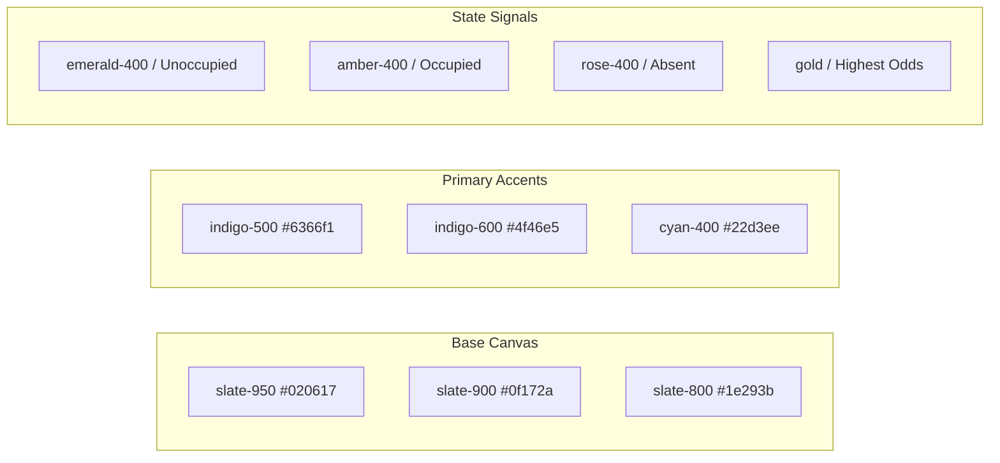
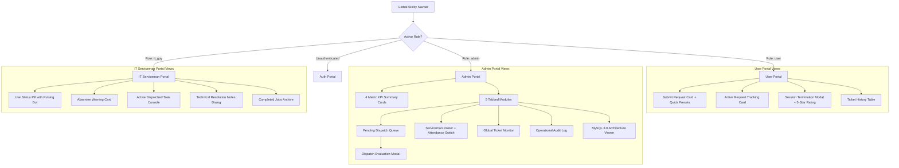
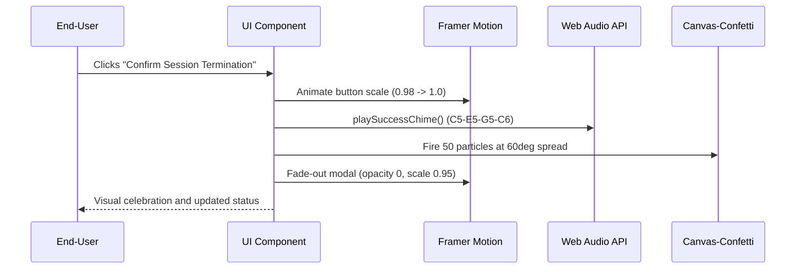

# IT SERVICE DISPATCH SYSTEM
## UI/UX DESIGN BRIEF & DESIGN SYSTEM SPECIFICATION
**Document Version:** 2.0.0  
**Design System Name:** Orbit Dark Modern Enterprise  
**Status:** Approved & Implemented  
**Target Devices:** Desktop (Primary), Tablet & Mobile (Full Responsive)  

---

## 1. Design Philosophy & Aesthetic Tenets

The IT Service Dispatch System user experience is designed around four foundational tenets:

1. **Mission-Critical Clarity & High Contrast:** IT issues cause friction and stress for employees; field technicians often operate on mobile screens in server rooms or hallways. The interface employs a deep dark canvas (`slate-950`) paired with vibrant status indicators to ensure instantaneous comprehension with zero visual clutter.
2. **Algorithmic Explainability & Trust:** Rather than presenting an opaque "black box" dispatch decision, the UI exposes the reasoning behind every technician assignment. Visual odds percentages, ranking badges, and an interactive "Odds Engine" explainer modal foster trust between technicians and supervisors.
3. **Accountability Through Enforced Closure:** The UI strictly reflects the closed-loop operational model. Technicians see their cards transition to a waiting state once work is done, and end-users are provided an unmissable, celebratory session termination modal with 5-star feedback and confetti.
4. **Multimodal Sensory Feedback:** In addition to motion transitions, state mutations trigger procedural audio cues (Web Audio API synthesized chimes), reinforcing immediate physical confirmation when a ticket is submitted, dispatched, or completed.

---

## 2. Color Palette & Design Tokens

### 2.1 Complete Token Hierarchy

| Token Name | Hex Code | Tailwind Class | Semantic Usage |
| :--- | :--- | :--- | :--- |
| **Canvas Background** | `#020617` | `bg-slate-950` | Primary application root background. |
| **Card Surface** | `#0f172a` | `bg-slate-900` | Modals, data cards, form containers, table rows. |
| **Border / Divider** | `#1e293b` | `border-slate-800` | Subtle component boundaries and dividers. |
| **Primary Accent** | `#6366f1` | `bg-indigo-500` | Primary buttons, active tabs, brand icons. |
| **Accent Glow** | `rgba(99, 102, 241, 0.15)` | `from-indigo-950/40` | Radial ambient lighting behind modals and headers. |
| **Unoccupied (Available)** | `#34d399` | `text-emerald-400` | Free technician status, success banners, online badges. |
| **Occupied (Busy)** | `#fbbf24` | `text-amber-400` | In-service technicians, in-progress tickets, warnings. |
| **Absent (On Leave)** | `#f87171` | `text-rose-400` | Technician out-of-working area notice, critical tickets. |
| **Highest Odds Gold** | `#f59e0b` | `text-amber-300` | Rank #1 recommendation badge, star ratings. |
| **High Urgency** | `#fb923c` | `text-orange-400` | High-priority tickets requiring rapid dispatch. |
| **Critical Urgency** | `#ef4444` | `text-red-500` | Boardroom or outage tickets requiring immediate dispatch. |

---

## 3. Typographic Hierarchy & Iconography

### 3.1 Typography Scale
- **System Font Stack:** Inter, system-ui, -apple-system, BlinkMacSystemFont, "Segoe UI", Roboto, sans-serif.
- **Monospace Stack:** ui-monospace, SFMono-Regular, Menlo, Monaco, Consolas, "Liberation Mono", monospace.

| Element | Size / Line Height | Weight | Tailwind Utility | Tracking |
| :--- | :--- | :--- | :--- | :--- |
| **Portal Page Title** | 24px–30px (1.2) | Extrabold (800) | `text-2xl sm:text-3xl font-extrabold` | `-0.02em` |
| **Card / Modal Heading** | 18px–20px (1.25)| Bold (700) | `text-lg sm:text-xl font-bold` | `-0.01em` |
| **Section Eyebrow** | 10px–11px (1.4) | Semibold (600) | `text-[10px] sm:text-xs uppercase font-semibold` | `+0.05em` |
| **Body Standard** | 13px–14px (1.5) | Regular (400) | `text-xs sm:text-sm text-slate-300` | `normal` |
| **Data Metric Large** | 28px–32px (1.1) | Black (900) | `text-2xl sm:text-3xl font-black text-white` | `-0.03em` |
| **Badge / Micro Tag** | 10px–11px (1.2) | Bold (700) | `text-[10px] sm:text-xs font-bold` | `normal` |

### 3.2 Semantic Iconography (Lucide React)
- **Role Identity:** `Shield` (Admin), `Wrench` (IT Serviceman), `Users` (Requester).
- **Status Indicators:** `CheckCircle2` (Completed / Closed), `Clock` (Pending / In-Progress), `UserX` (Absent), `UserCheck` (Available).
- **Odds & Intelligence:** `Sparkles` (Highest Odds / Algorithmic Engine), `ArrowUpDown` (Sorting).
- **Urgency Signals:** `Flame` (Critical / Urgent), `AlertTriangle` (Medium / Warning), `Info` (Low).

---

## 4. Information Architecture & Portal Views

### 4.1 Screen Specifications

#### 1. Authentication Portal (`AuthPortal.tsx`)
- **Visual Composition:** Centered 540px modal with subtle radial backdrop blur.
- **Role Tabs:** Seamless pill toggle between "Sign In" and "Create Account".
- **One-Click Demo Access:** Three quick-fill buttons allowing instant one-click login as the Designated Admin, Demo Requester, or Demo IT Serviceman.
- **Dynamic Skills Selector:** When "IT Serviceman" is selected during registration, a multi-select grid of technical skill pills (Hardware, Dual Displays, Cisco Routers, Zoom Rooms) appears.
- **Security Guardrail:** The `admin` role is completely hidden and inaccessible on the registration form.

#### 2. Admin Command Center (`AdminPortal.tsx`)
- **Metric Banners:** Four responsive cards showing Pending Approvals, Unoccupied Technicians (emerald), Busy Technicians (amber), and Absent Technicians (rose).
- **Dispatch Modal:** Triggered on pending tickets. Features a sorted candidate list. The technician with the highest odds is highlighted with a gold border, `⭐ HIGHEST ODDS` badge, and an explanation of their idle time and round status.
- **Roster Attendance Controls:** Table containing technician avatars, status badges, round assignment counters, and action buttons (`Mark Absent` / `Restore to Unoccupied`).
- **Audit Ledger:** Chronological table displaying actor badge, action token, description, and relative timestamp.
- **MySQL Architecture Viewer:** Live code view of `mysql_schema.sql` with one-click "Copy SQL" and "Download .sql" actions.

#### 3. IT Serviceman Station (`ITGuyPortal.tsx`)
- **Status Badge:** Prominent indicator showing Unoccupied (emerald ping dot), Occupied (amber pulse dot), or Absent (rose static dot).
- **Absentee Banner:** High-visibility banner when marked absent by admin, informing the technician that dispatches are paused.
- **Active Task Console:** Displays requester contact details, building, floor, room, urgency badge, and action workflow:
  - Button: "Start Working on Ticket" (moves ticket to `in_progress`).
  - Button: "Finish Technical Labor" (opens resolution dialog).
- **Resolution Dialog:** Requires written notes describing parts replaced or diagnostic tests performed before submitting.

#### 4. Requester Portal (`UserPortal.tsx`)
- **Rapid Submission Card:** Clean form featuring category dropdown, urgency selector, and location fields.
- **Quick Preset Buttons:** Three one-click templates:
  - *Monitor Blackout* (Hardware / High / Room 304).
  - *Audio Matrix Failure* (Audio/Visual / Critical / Room 102).
  - *Laser Printer Jam* (Printer / Medium / Room 210).
- **Awaiting Verification Banner:** Highlighted banner appearing as soon as a technician marks work completed.
- **Session Termination Modal:** Interactive 5-star rating selector, feedback textarea, and confirm button that triggers confetti and sound effects.

---

## 5. Micro-interactions, Motion, and Auditory Feedback

### 5.1 Motion Design Specifications
- **Modal Open/Close:** Spring animation with `opacity: 0, scale: 0.95, y: 20` to `opacity: 1, scale: 1, y: 0` over 200ms.
- **Tab Switching:** AnimatePresence with cross-fade `opacity: 0, y: 8` over 150ms.
- **Status Dots:** CSS `@keyframes ping` on available status; `@keyframes pulse` on active jobs.

### 5.2 Synthesized Audio Profiles
- **`playSuccessChime()`:** Pleasant 4-note ascending chord for successful session termination, ticket completion, and login.
- **`playDispatchChime()`:** Dual-tone chime (349 Hz $\rightarrow$ 440 Hz) notifying technicians of incoming dispatches.
- **`playAlertTone()`:** Sharp 880 Hz ping for new tickets and attendance changes.

---

## 6. Accessibility & Responsive Guidelines

1. **Color Independence:** No status is communicated solely by color. Statuses always combine a color token, a distinct icon (`CheckCircle2`, `Clock`, `UserX`), and explicit text labels (`Unoccupied`, `Occupied`, `Absent`).
2. **Focus Visibility:** All interactive buttons and inputs have high-contrast focus rings (`focus:ring-2 focus:ring-indigo-500 focus:outline-none`).
3. **Responsive Breakpoints:**
   - **Mobile (< 640px):** Single-column layout, bottom-sheet style modals, stacked buttons, abbreviated titles.
   - **Tablet (640px – 1024px):** 2-column grids for dashboard KPI cards, full tables with horizontal scroll.
   - **Desktop (> 1024px):** 4-column KPI cards, side-by-side forms and status monitors.
